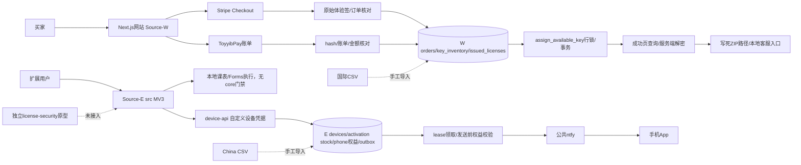
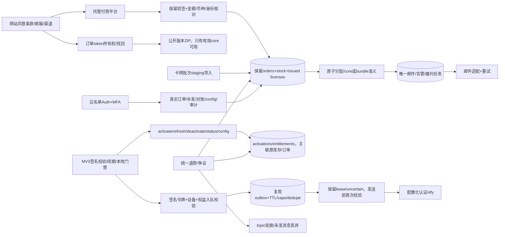
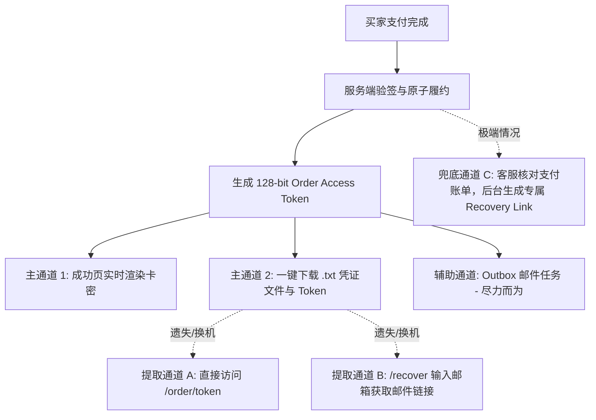

# 架构与数据流

2026-10-06只读基线。当前源码与目标分开，目标图不代表已实现或部署。

## 当前调用图

W和E只使用源码/历史文档别名；不展示项目凭据。主E是Edge-only，不是anon直写表。云端部署/cron未在本任务核实。

## 目标调用图（待实现）

单一生产数据库由人类切换；开发始终使用独立localhost/dev。网站schema为扩展主后端提供统一部署入口，旧E迁移保留历史，不能拼接后直接执行。保留本地Forms可靠性、免费本机通知与恢复证据；敏感学校资料不上传。

## 仓库归属与所有权划分（唯一事实来源）

- **后端唯一所有者：网站仓库 (`Auto-Check Website`)**
  - **唯一拥有** 所有 Supabase 数据库迁移（`supabase/migrations/`）。
  - **唯一拥有** 所有服务端 Edge Functions（`supabase/functions/{activate,refresh,deactivate,status,config,...}`）。
  - **唯一拥有** 支付、订单履约、退款、通知队列分发（worker）与卡网库存导入工具。
- **客户端仓库：扩展仓库 (`auto-check-extension`)**
  - **仅包含** 浏览器扩展客户端代码（MV3 `manifest.json`、`src/`、打包构建脚本、客户端 UI 与离线签名校验）。
  - 不再独立维护任何生产数据库迁移或平行 Edge Functions；所有服务端请求严格通过网站仓库发布的 Edge Functions 接口交互。

## 状态与可靠性边界

- **扩展 Core 门禁的“失败时宽松”（Fail-open for previously active）**：
  - 未激活用户：严格锁定所有自动化功能，引导购买/激活。
  - 已激活用户：启动与运行时验证签名与本地宽限期。若遇网络离线、Edge Function 宕机或服务端错误，**绝不中断正在进行的打卡任务**，仅在扩展界面提示网络异常/待续期；只有服务端明确返回已吊销/已退款或本地超过 72 小时宽限期才锁定。

- 支付确认先持久化，履约事务不成功也不得丢收款事实。
- 邮件、告警、退款副作用用唯一任务与outbox，不把外部发送纳入数据库事务假装原子。
- 订单access token只存hash；裸UUID不足以查看key；邮件找回泛化响应。
- key库存可available→assigned→revoked；已撤销不回库存；同订单重放不新发。
- 新通知有效期首次激活起算；历史到期保持；退款撤销关联key、activation、entitlement，轮换topic。
- 通知provider接受不等于手机送达；不确定发送隔离，不承诺exactly-once送达。
- 签名许可+72h宽限支持已授权用户短期离线；离线撤销非即时，客户端JS可改，不能承诺绝对防破解。

## 零成本交付架构与多通道拓扑（附录 B.8 与 Southampton 试运营）

为在零资金（无自定义域名、无 Supabase Pro）下稳健运行，系统采取“去中心化本地凭证 + 多通道找回”架构：

1. **交付不阻塞于邮件**：主交付发生于支付成功回调页，提供纯前端生成并下载的 `.txt` 凭证与代码复制功能。
2. **凭据安全模型**：订单凭证（`order_access_token`）高熵随机生成，数据库仅存储加盐 SHA-256 哈希；即使邮件被拦截，持有 Token 的买家可直接访问 `/order/[token]` 提取卡密与专属下载链接。
3. **域名无关性解耦**：所有外部链接动态拼接自环境配置（`APP_URL`/`PUBLIC_BASE_URL`），核心业务与扩展无任何硬编码域名，支持日后一键无感升级迁移至自定义域名。
4. **免费层休眠防御拓扑**：GitHub Actions 定时 Ping（主）与 Vercel Cron（备）形成数据库双重保活防线，保障学期内学生随时可离线续期与激活。

