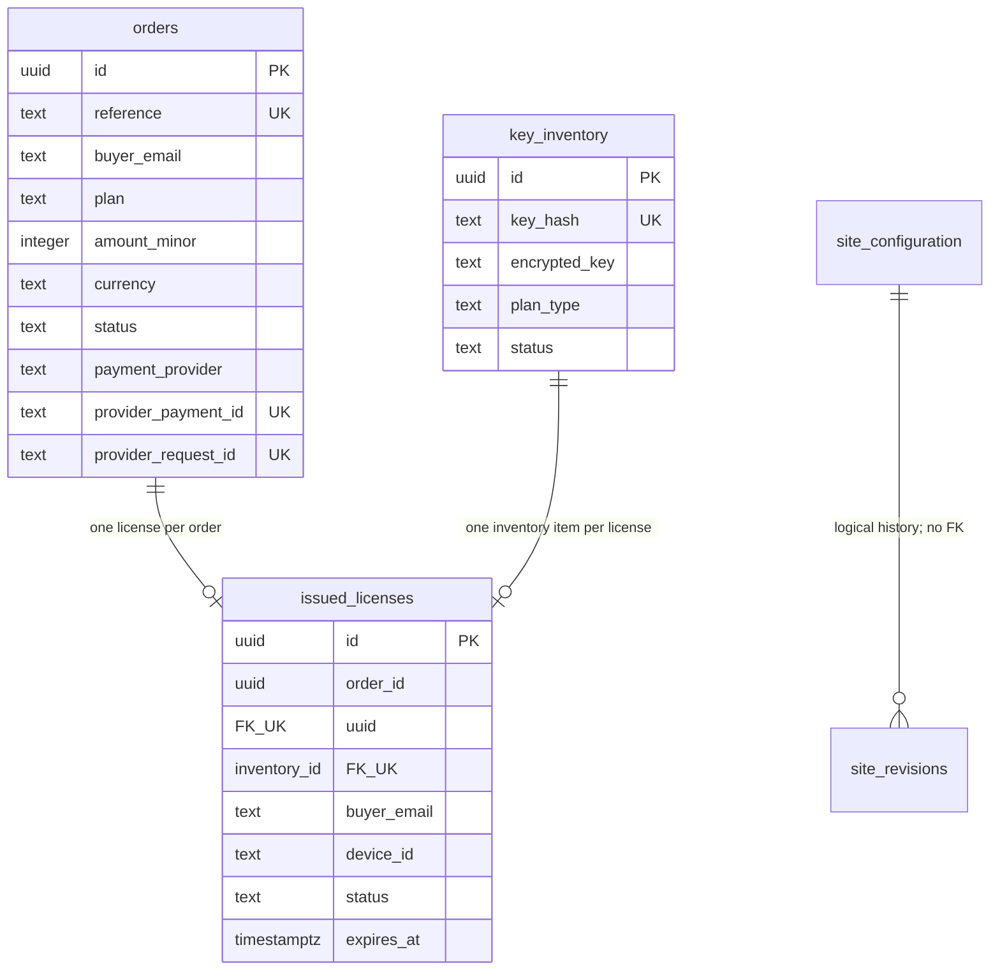
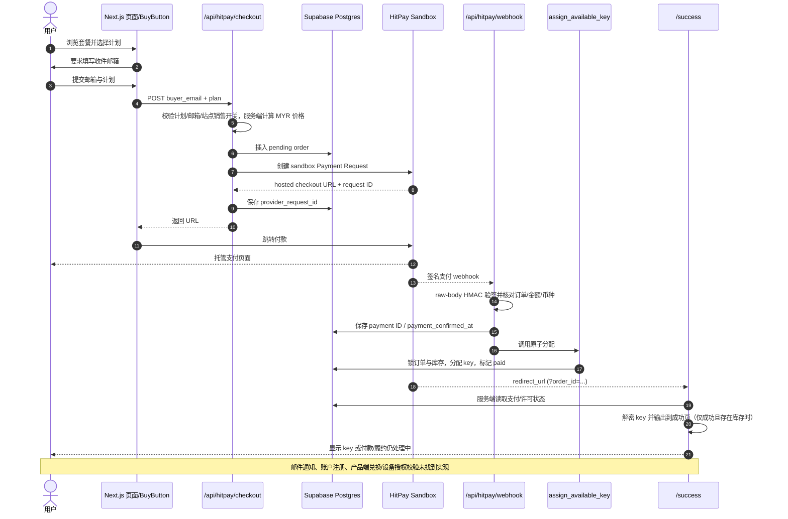

# Auto-Check Website 系统说明与上线前代码审计报告

> 审计快照：2026-10-05（Asia/Kuala_Lumpur）。本报告依据当前工作区代码、配置、迁移、README 和现有测试文件撰写。仓库当时存在预先存在的未提交改动；审计没有改动任何既有文件。仅新增本报告。`.env.local` 和 `generated_keys/` 中的明文密钥内容未被报告读取或复制。
>
> 证据标注规则：每个具体事实尽量附源文件 `路径:行号`。本报告不代表已经检查云端 Supabase、HitPay 商户账户、实际部署平台或外部数据库的运行状态；对这些范围标注为“⚠️ 不确定，需要人工确认”。

## 审计结论摘要

- **当前不能据此开始公开收费。** 仓库没有 Stripe 实现；真实代码使用的是只允许 sandbox host 的 HitPay。项目文档还记录没有完成真实 sandbox 支付闭环，也未证明线上部署和最新迁移状态。[`lib/hitpay.ts:13-19`](../lib/hitpay.ts:13) [`docs/hitpay-integration-setup.md:1-3,45-47`](hitpay-integration-setup.md:1)
- **网站内没有用户兑换/激活/许可证验证接口。** 代码能生成、加密保存和在支付成功页展示 key，但没有提交 key 的兑换表单、设备绑定或授权校验。[`lib/admin-keys.ts:5-18`](../lib/admin-keys.ts:5) [`app/success/page.tsx:48-73`](../app/success/page.tsx:48)
- **有签名验证及数据库原子履约，但售卖恢复链路仍有空缺。** 缺货时 webhook 存储已确认付款并返回 200；仓库没有自动重试队列或后台补发按钮。[`app/api/hitpay/webhook/route.ts:30-68`](../app/api/hitpay/webhook/route.ts:30) [`supabase/migrations/20261004172416_license_expiration_dates.sql:74-110`](../supabase/migrations/20261004172416_license_expiration_dates.sql:74)
- **退款、争议/拒付、邮件、法律政策、自动备份和第三方错误监控未找到完整实现。** 本报告第 4、7、9、10 节详细说明及列出证据。[`app/api/hitpay/webhook/route.ts:17-18`](../app/api/hitpay/webhook/route.ts:17) [`README.md:79-83`](../README.md:79)
- **报告不包含任何真实凭据或密钥。** 环境变量仅列出名称、用途、是否必需及前端可见性；工作区存在的密钥批次文件只记录文件类型和风险，不暴露内容。[`.env.example:6-27`](../.env.example:6) [`scripts/generate-intl-keys.js:79-98`](../scripts/generate-intl-keys.js:79)

## 1. 项目总览

### 1.1 技术栈和版本

| 项目 | 当前实现 | 证据 |
|---|---|---|
| Web 框架 | Next.js App Router，`next` 16.3.8 | [`package.json:22-37`](../package.json:22)；页面及路由文件位于 `app/`，例如 [`app/page.tsx:1-8`](../app/page.tsx:1) |
| 语言 | TypeScript 7.0.2；另有少量 JavaScript/JSX | [`package.json:39-47`](../package.json:39)；脚本 [`scripts/generate-intl-keys.js:1-2`](../scripts/generate-intl-keys.js:1) |
| UI | React / React DOM 19.3.0；Tailwind CSS 4.3.3；Framer Motion 14.0.0；GSAP 3.15.0；Lenis 1.3.26 | [`package.json:22-37`](../package.json:22) |
| 数据库 | Supabase Postgres（订单、key inventory、issued licenses、站点管理）；本地演示另用 Node 原生 SQLite | [`lib/supabase/commerce.ts:7-20`](../lib/supabase/commerce.ts:7) [`lib/store.ts:1-15`](../lib/store.ts:1) |
| ORM/DB SDK | 未发现传统 ORM；Supabase JS 2.117.2 查询数据库，迁移为 SQL | [`package.json:22-37`](../package.json:22) [`lib/supabase/commerce.ts:3-4`](../lib/supabase/commerce.ts:3) |
| 密钥加密 | Node `crypto` SHA-256 和 AES-256-GCM | [`lib/admin-keys.ts:3-18`](../lib/admin-keys.ts:3) [`lib/license-key-encryption.ts:3-7`](../lib/license-key-encryption.ts:3) |
| 支付 | HitPay sandbox Payment Request API；未发现 Stripe SDK、API 或环境变量 | [`app/api/hitpay/checkout/route.ts:20-76`](../app/api/hitpay/checkout/route.ts:20) [`lib/hitpay.ts:13-19`](../lib/hitpay.ts:13) [`package.json:22-37`](../package.json:22) |
| 邮件 | 未发现邮件服务 SDK 或发送实现；HitPay 请求关闭供应商邮件/SMS | [`app/api/hitpay/checkout/route.ts:64-69`](../app/api/hitpay/checkout/route.ts:64) [`README.md:81-83`](../README.md:81) |
| 运行时 | Node.js `>=24`；Node 原生 SQLite 用于本地演示 | [`package.json:19-21`](../package.json:19) [`lib/store.ts:1`](../lib/store.ts:1) |
| 部署平台 | README 将云端部署描述为待办，HitPay 文档也称部署和线上验证待确认；代码库未证明实际部署平台或环境 | [`README.md:73-83`](../README.md:73) [`docs/hitpay-integration-setup.md:45-47`](hitpay-integration-setup.md:45) |

### 1.2 目录结构

| 目录/文件 | 用途与边界 | 证据 |
|---|---|---|
| `app/` | App Router 页面、API route handlers、管理员 Server Actions、布局和错误页面 | [`app/layout.tsx:1-21`](../app/layout.tsx:1) [`app/api/hitpay/webhook/route.ts:7-9`](../app/api/hitpay/webhook/route.ts:7) |
| `components/` | 商店、购买表单、支付返回、订单和客服 UI | [`components/BuyButton.tsx:139-177`](../components/BuyButton.tsx:139) [`components/PaymentReturn.tsx:10-17`](../components/PaymentReturn.tsx:10) |
| `lib/` | 支付、数据库、密钥、安全、站点设置、订单等 server/client 逻辑 | [`lib/hitpay.ts:1-4`](../lib/hitpay.ts:1) [`lib/store.ts:1-8`](../lib/store.ts:1) |
| `supabase/migrations/` | Postgres schema、RLS/grants、履约 RPC、站点管理迁移 | [`supabase/migrations/20261004032804_commerce_and_inventory.sql:1-7`](../supabase/migrations/20261004032804_commerce_and_inventory.sql:1) |
| `tests/` | Node 测试、PGlite 迁移/RPC 测试、Playwright 浏览器测试 | [`package.json:5-17`](../package.json:5) |
| `scripts/` | 管理预览及国际版密钥批处理脚本 | [`package.json:16-17`](../package.json:16) |
| `public/` | 静态图片、动画 demo、worker 等；当前没有找到支付成功页指向的扩展 ZIP | 通过当前 `public/` 文件清单核对；链接实现在 [`components/PaymentReturn.tsx:59-60,106-112`](../components/PaymentReturn.tsx:59) |
| `docs/` | 集成指南、架构草案、安全审计、性能说明和历史计划；部分支付文档与当前代码状态冲突 | [`docs/pre-flight-security-audit.md:230-243,268-287`](pre-flight-security-audit.md:230) [`docs/hitpay-integration-setup.md:1-3,45-47`](hitpay-integration-setup.md:1) |
| `.env.example` | 环境变量名称及本地/生产配置说明；未包含真实值 | [`.env.example:1-27`](../.env.example:1) |

### 1.3 所有页面路由

页面路由按 `app/**/page.tsx` 清单整理。默认没有用户账号登录；`/admin` 使用独立管理员认证，token 页面使用 capability URL。[`app/admin/page.tsx:18-39`](../app/admin/page.tsx:18) [`app/order/[token]/page.tsx:1-2`](../app/order/%5Btoken%5D/page.tsx:1)

| 方法 | 页面路径 | 作用 | 登录/鉴权及调用者 | 证据 |
|---|---|---|---|---|
| GET | `/` | 读取已发布配置并渲染首页/商品页 | 公开 | [`app/page.tsx:5-8`](../app/page.tsx:5) |
| GET | `/success` | 按 `order_id` 或 `reference` 读取服务端支付/履约状态并展示结果 | 公开；URL 参数只定位记录，不单独证明已付款 | [`app/success/page.tsx:15-45`](../app/success/page.tsx:15) |
| GET | `/checkout/[token]` | 本地演示订单结账 UI | 公开 capability token；对应 API 生产拒绝 | [`app/checkout/[token]/page.tsx:1-2`](../app/checkout/%5Btoken%5D/page.tsx:1) [`lib/security.ts:3-8`](../lib/security.ts:3) |
| GET | `/order/[token]` | 本地模拟订单状态、交付预览和客服链接 | 公开 capability token；返回 API 生产拒绝 | [`app/order/[token]/page.tsx:1-2`](../app/order/%5Btoken%5D/page.tsx:1) [`app/api/orders/[token]/route.ts:4-5`](../app/api/orders/%5Btoken%5D/route.ts:4) |
| GET | `/support` | 创建客服工单表单 | 公开 | [`app/support/page.tsx:1-2`](../app/support/page.tsx:1) |
| GET | `/support/[token]` | 查看/回复客服工单 | 公开 capability token；当前本地演示 API 生产拒绝 | [`app/support/[token]/page.tsx:1-2`](../app/support/%5Btoken%5D/page.tsx:1) [`app/api/support/[token]/route.ts:4-9`](../app/api/support/%5Btoken%5D/route.ts:4) |
| GET | `/admin` | 登录后显示密钥库存、站点管理和本地订单/客服操作 | 管理员密码登录；`ADMIN_DASHBOARD_PASSWORD`/`ADMIN_SESSION_SECRET` | [`app/admin/page.tsx:18-39`](../app/admin/page.tsx:18) [`lib/admin-auth.ts:17-28`](../lib/admin-auth.ts:17) |
| GET | `/admin/preview` | 预览草稿站点设置 | 必须有管理员 session，否则重定向 `/admin` | [`app/admin/preview/page.tsx:8-13`](../app/admin/preview/page.tsx:8) |
| GET | `/admin/local` | 旧的本地订单/客服 demo 管理页 | 仅非生产、`LOCAL_DEMO=true` 且 loopback | [`app/admin/local/page.tsx:5-8`](../app/admin/local/page.tsx:5) [`lib/admin-local.ts:5-12`](../lib/admin-local.ts:5) |

错误边界 `app/error.tsx`、404 `app/not-found.tsx`、`app/layout.tsx`、`app/template.tsx` 是框架文件而非独立页面 URL。[`app/error.tsx:1-2`](../app/error.tsx:1) [`app/not-found.tsx:1-2`](../app/not-found.tsx:1) [`app/layout.tsx:16-21`](../app/layout.tsx:16)

### 1.4 所有 API 路由

| HTTP 方法 | 路径 | 作用 | 鉴权/谁可调用 | 证据 |
|---|---|---|---|---|
| POST | `/api/hitpay/checkout` | 建立 MYR HitPay hosted payment request 并创建 pending 订单 | 无用户登录；匿名购买可调用；`internal_check` 额外要求管理员 session | [`app/api/hitpay/checkout/route.ts:20-49`](../app/api/hitpay/checkout/route.ts:20) |
| POST | `/api/hitpay/webhook` | 验签、核对支付事件并提交履约 RPC | 无 session；必须通过 HitPay raw-body signature 验证 | [`app/api/hitpay/webhook/route.ts:9-20`](../app/api/hitpay/webhook/route.ts:9) |
| POST | `/api/checkout` | 创建本地 SQLite 模拟订单 | 仅本机/开发模式且 `LOCAL_DEMO=true`；有限流，不是生产购买 API | [`app/api/checkout/route.ts:4-6`](../app/api/checkout/route.ts:4) |
| GET, POST | `/api/orders/[token]` | 查询本地订单；模拟完成付款或取消 | 本机/开发模式；token 持有者；POST 要求 Origin 同源并有限流 | [`app/api/orders/[token]/route.ts:4-9`](../app/api/orders/%5Btoken%5D/route.ts:4) [`lib/security.ts:3-8,24-30`](../lib/security.ts:3) |
| GET, POST | `/api/admin` | 查询本地订单/工单；执行本地退款模拟、重发、回复、关闭 | 本机/开发模式且旧 `vf_admin` cookie；POST Origin 校验 | [`app/api/admin/route.ts:3-14`](../app/api/admin/route.ts:3) |
| POST, DELETE | `/api/admin/session` | 旧本地管理员登录/登出 | 本机/开发模式；POST 每分钟每 host 最多 10 次 | [`app/api/admin/session/route.ts:3-8`](../app/api/admin/session/route.ts:3) |
| POST | `/api/support` | 创建 SQLite 客服工单 | 公开本地演示；每分钟 hostname 限流 20 次；生产拒绝 | [`app/api/support/route.ts:3-5`](../app/api/support/route.ts:3) |
| GET, POST | `/api/support/[token]` | 通过 capability token 查询/回复本地工单 | 公开本地演示；POST 有限流；生产拒绝 | [`app/api/support/[token]/route.ts:4-9`](../app/api/support/%5Btoken%5D/route.ts:4) |
| GET | `/api/site/assets/[id]` | 取可见的已发布 guide 图片；管理员可取草稿图片 | 公开资源仅发布且 visible；草稿资源要求管理员 session | [`app/api/site/assets/[id]/route.ts:6-18`](../app/api/site/assets/%5Bid%5D/route.ts:6) |
| GET | `/api/site/download/[token]` | 下载本地订单绑定的 release ZIP | 需本地模式 + 订单 token、`paid`、未过期、符合套餐；生产被 `localOnly` 拒绝 | [`app/api/site/download/[token]/route.ts:6-19`](../app/api/site/download/%5Btoken%5D/route.ts:6) |

未找到 `/api/stripe/*`、Stripe webhook、用户兑换 API、账号注册 API、退款支付 API 或 cron route。支付/兑换未实现结论见第 3、4 节；周期性测试/构建脚本见 [`package.json:5-17`](../package.json:5)。

## 2. 数据库与数据模型

### 2.1 当前 Postgres 业务表

以下是仓库迁移定义的目标 schema。云端是否已应用全部迁移不能仅由本地源码证明，且项目文档对具体部署迁移有时间差异；参见第 7.6 节。[`docs/site-management-setup.md:19-29`](site-management-setup.md:19) [`docs/hitpay-integration-setup.md:7,45,72`](hitpay-integration-setup.md:7)

#### `public.orders`

| 字段 | Postgres 类型 / null | 默认/约束/用途 | 证据 |
|---|---|---|---|
| `id` | `uuid NOT NULL` | PK，`gen_random_uuid()` | [`20261004032804_commerce_and_inventory.sql:8-10`](../supabase/migrations/20261004032804_commerce_and_inventory.sql:8) |
| `reference` | `text NOT NULL` | 唯一；不可空白 | [`20261004032804_commerce_and_inventory.sql:10,20`](../supabase/migrations/20261004032804_commerce_and_inventory.sql:10) |
| `buyer_email` | `text NOT NULL` | 非空、必须等于 `lower(btrim(...))` | [`20261004032804_commerce_and_inventory.sql:11,21-23`](../supabase/migrations/20261004032804_commerce_and_inventory.sql:11) |
| `plan` | `text NOT NULL` | 最终约束：`bundle`, `extension`, `semester`, `yearly`, `internal_check` | [`20261004032804_commerce_and_inventory.sql:12,24-25`](../supabase/migrations/20261004032804_commerce_and_inventory.sql:12) [`20261004115610_enable_extension_checkout.sql:5-8`](../supabase/migrations/20261004115610_enable_extension_checkout.sql:5) |
| `amount_minor` | `integer NOT NULL` | `>=0`；以 minor currency unit 保存 | [`20261004032804_commerce_and_inventory.sql:13,26`](../supabase/migrations/20261004032804_commerce_and_inventory.sql:13) |
| `currency` | `text NOT NULL` | 必须匹配大写 3 字母代码 | [`20261004032804_commerce_and_inventory.sql:14,27`](../supabase/migrations/20261004032804_commerce_and_inventory.sql:14) |
| `status` | `text NOT NULL` | 默认 `pending`；仅 `pending/paid/cancelled/refunded` | [`20261004032804_commerce_and_inventory.sql:15,28-29`](../supabase/migrations/20261004032804_commerce_and_inventory.sql:15) |
| `payment_provider` | `text NOT NULL` | 非空白；checkout 写入 `hitpay` | [`20261004032804_commerce_and_inventory.sql:16,30`](../supabase/migrations/20261004032804_commerce_and_inventory.sql:16) [`app/api/hitpay/checkout/route.ts:43-49`](../app/api/hitpay/checkout/route.ts:43) |
| `provider_payment_id` | `text NULL` | UNIQUE；非空时不可空白 | [`20261004032804_commerce_and_inventory.sql:17-18,31-33`](../supabase/migrations/20261004032804_commerce_and_inventory.sql:17) |
| `paid_at` | `timestamptz NULL` | 后续迁移新增；履约成功时设定 | [`20261004040308_create_fulfillment_rpc.sql:3-4,69-71`](../supabase/migrations/20261004040308_create_fulfillment_rpc.sql:3) |
| `provider_request_id` | `text NULL` | UNIQUE；区分 checkout request 与支付交易 | [`20261004042022_hitpay_payment_tracking.sql:5-10,16`](../supabase/migrations/20261004042022_hitpay_payment_tracking.sql:5) |
| `payment_confirmed_at` | `timestamptz NULL` | 有值时要求 `provider_payment_id` 非空 | [`20261004042022_hitpay_payment_tracking.sql:7,13-17`](../supabase/migrations/20261004042022_hitpay_payment_tracking.sql:7) |
| `fulfillment_error` | `text NULL` | 仅允许 `INVENTORY_EXHAUSTED` | [`20261004042022_hitpay_payment_tracking.sql:8,11-12,18`](../supabase/migrations/20261004042022_hitpay_payment_tracking.sql:8) |

orders 索引含 PK `id`、唯一 `reference`、唯一可空 `provider_payment_id`、唯一可空 `provider_request_id`；Postgres UNIQUE 会建立相应索引。[`20261004032804_commerce_and_inventory.sql:8-18`](../supabase/migrations/20261004032804_commerce_and_inventory.sql:8) [`20261004042022_hitpay_payment_tracking.sql:5-8`](../supabase/migrations/20261004042022_hitpay_payment_tracking.sql:5)

#### `public.key_inventory`

| 字段 | 类型 / null | 默认/约束/用途 | 证据 |
|---|---|---|---|
| `id` | `uuid NOT NULL` | PK，随机 UUID 默认值 | [`20261004032804_commerce_and_inventory.sql:35-36`](../supabase/migrations/20261004032804_commerce_and_inventory.sql:35) |
| `key_hash` | `text NOT NULL` | UNIQUE；格式为 64 位小写 hex SHA-256 | [`20261004032804_commerce_and_inventory.sql:37,41-42`](../supabase/migrations/20261004032804_commerce_and_inventory.sql:37) |
| `encrypted_key` | `text NULL` | 版本化 AES-256-GCM 密文；后续迁移添加；历史 hash-only 库存可为空 | [`20261004171118_keyless_extension_license_delivery.sql:3-7`](../supabase/migrations/20261004171118_keyless_extension_license_delivery.sql:3) |
| `plan_type` | `text NOT NULL` | 最终 allowlist 同当前 key plans：`bundle/extension/semester/yearly/internal_check` | [`20261004032804_commerce_and_inventory.sql:38,43-45`](../supabase/migrations/20261004032804_commerce_and_inventory.sql:38) [`20261004115610_enable_extension_checkout.sql:10-13`](../supabase/migrations/20261004115610_enable_extension_checkout.sql:10) |
| `status` | `text NOT NULL` | 默认 `available`；仅 `available/assigned` | [`20261004032804_commerce_and_inventory.sql:39,45`](../supabase/migrations/20261004032804_commerce_and_inventory.sql:39) |

索引：唯一 `key_hash`、部分索引 `(plan_type,id) WHERE status='available'`；无数据库创建时间字段。[`20261004032804_commerce_and_inventory.sql:48-50`](../supabase/migrations/20261004032804_commerce_and_inventory.sql:48) [`lib/admin-key-data.ts:31-36`](../lib/admin-key-data.ts:31)

#### `public.issued_licenses`

| 字段 | 类型 / null | 默认/约束/用途 | 证据 |
|---|---|---|---|
| `id` | `uuid NOT NULL` | PK，随机 UUID | [`20261004032804_commerce_and_inventory.sql:52-53`](../supabase/migrations/20261004032804_commerce_and_inventory.sql:52) |
| `order_id` | `uuid NOT NULL` | UNIQUE FK → `orders.id`，`ON DELETE RESTRICT`，一订单最多一 license | [`20261004032804_commerce_and_inventory.sql:54`](../supabase/migrations/20261004032804_commerce_and_inventory.sql:54) |
| `inventory_id` | `uuid NOT NULL` | UNIQUE FK → `key_inventory.id`，`ON DELETE RESTRICT`，一库存 key 最多分配一次 | [`20261004032804_commerce_and_inventory.sql:55`](../supabase/migrations/20261004032804_commerce_and_inventory.sql:55) |
| `buyer_email` | `text NOT NULL` | 非空、trim/lowercase 规范化 | [`20261004032804_commerce_and_inventory.sql:56,63-65`](../supabase/migrations/20261004032804_commerce_and_inventory.sql:56) |
| `plan_type` | `text NOT NULL` | 受 plan allowlist check 约束，后续加入 `extension` | [`20261004032804_commerce_and_inventory.sql:57,66-68`](../supabase/migrations/20261004032804_commerce_and_inventory.sql:57) [`20261004115610_enable_extension_checkout.sql:15-18`](../supabase/migrations/20261004115610_enable_extension_checkout.sql:15) |
| `device_id` | `text NULL` | 预留设备绑定字段；未找到业务代码写入 | [`20261004032804_commerce_and_inventory.sql:58`](../supabase/migrations/20261004032804_commerce_and_inventory.sql:58) |
| `status` | `text NOT NULL` | 默认 `active`；仅 `active/revoked` | [`20261004032804_commerce_and_inventory.sql:59,68`](../supabase/migrations/20261004032804_commerce_and_inventory.sql:59) |
| `activated_at` | `timestamptz NULL` | 预留激活时间；目前签发不代表激活 | [`20261004032804_commerce_and_inventory.sql:60-62`](../supabase/migrations/20261004032804_commerce_and_inventory.sql:60) |
| `expires_at` | `timestamptz NULL` | 后续迁移添加 | [`20261004172416_license_expiration_dates.sql:3-7`](../supabase/migrations/20261004172416_license_expiration_dates.sql:3) |

索引/约束包括 PK、`order_id` unique FK、`inventory_id` unique FK；未发现 `device_id` 或 `expires_at` 的专用索引。[`20261004032804_commerce_and_inventory.sql:52-69`](../supabase/migrations/20261004032804_commerce_and_inventory.sql:52) [`20261004172416_license_expiration_dates.sql:3-7`](../supabase/migrations/20261004172416_license_expiration_dates.sql:3)

### 2.2 站点管理表和本地 SQLite 表

| 表/集合 | 字段和约束 | 索引/关系/权限 | 证据 |
|---|---|---|---|
| `public.site_configuration` | `id integer PK CHECK(id=1)`；`version bigint NOT NULL DEFAULT 0 CHECK >=0`；`draft jsonb`、`published jsonb` 均必须为 object；`updated_at timestamptz DEFAULT now()` | RLS enable+force；无浏览器 grant；singleton config | [`20261003182731_site_management.sql:2-7,47-57`](../supabase/migrations/20261003182731_site_management.sql:2) |
| `public.site_revisions` | UUID PK；`version bigint CHECK >=0`；`config jsonb object`；`note text DEFAULT ''` 且最多 300 字符；`created_at timestamptz DEFAULT now()` | `created_at DESC` 索引；无外键 | [`20261003182731_site_management.sql:9-15,32,55-57`](../supabase/migrations/20261003182731_site_management.sql:9) |
| `public.site_activity` | UUID PK；`action text` 长度 1..100；`detail text DEFAULT ''` 最多 500；`created_at timestamptz DEFAULT now()` | `created_at DESC` 索引；无外键 | [`20261003182731_site_management.sql:16-20,32,55-57`](../supabase/migrations/20261003182731_site_management.sql:16) |
| `public.site_assets` | UUID PK；`kind` 为 guide/release；`mime` allowlist；`size bigint` 1..20MiB；`name text` 长 1..120；`object_path text UNIQUE`；创建时间；guide 只许 image 且 ≤5MiB，release 只许 ZIP | RLS enable+force；无外键；关联 private Storage bucket | [`20261003182731_site_management.sql:22-30,53-57,97-100`](../supabase/migrations/20261003182731_site_management.sql:22) |
| `public.site_uploads` | UUID PK；kind/mime/size/name/object_path 与资产相似；`expires_at timestamptz DEFAULT now()+30m` | `object_path UNIQUE`；无 expiry index；RLS enable+force；无自动过期清理任务 | [`20261003182731_site_management.sql:34-46`](../supabase/migrations/20261003182731_site_management.sql:34) |
| SQLite `orders` | `id TEXT PK`, `token TEXT UNIQUE NOT NULL`, `reference TEXT UNIQUE NOT NULL`, `data TEXT NOT NULL`（JSON 化 `Order`） | SQLite 本地演示；使用 WAL 和 `BEGIN IMMEDIATE` 事务 | [`lib/store.ts:10-24`](../lib/store.ts:10) [`lib/types.ts:1-2`](../lib/types.ts:1) |
| SQLite `tickets` | `id TEXT PK`, `token TEXT UNIQUE NOT NULL`, `data TEXT NOT NULL`（JSON 化 `Ticket`） | SQLite 本地客服 demo；无用户表 | [`lib/store.ts:14-15`](../lib/store.ts:14) [`lib/types.ts:3-4`](../lib/types.ts:3) |
| 本地站点 SQLite | `site_state(id,version,draft,published)`、`site_history(id,version,config,note,created_at)`、`site_activity(id,action,detail,created_at)`、`site_assets(id,kind,mime,size,name,path,created_at)` | 仅显式本地站点管理；本地事务 | [`lib/site-local-store.ts:17-34`](../lib/site-local-store.ts:17)（本地表初始化） |

迁移将早期 `public.activation_keys` 删掉，而不是迁移其旧数据；这是迁移注释明确记录的行为。[`20261004032804_commerce_and_inventory.sql:3-6,96-116`](../supabase/migrations/20261004032804_commerce_and_inventory.sql:3)

### 2.3 表关系图

外键及唯一性来自 `issued_licenses` 的两个 `UNIQUE` FK；站点配置、历史、资产、上传之间没有定义外键。[`20261004032804_commerce_and_inventory.sql:52-69`](../supabase/migrations/20261004032804_commerce_and_inventory.sql:52) [`20261003182731_site_management.sql:2-42`](../supabase/migrations/20261003182731_site_management.sql:2)

## 3. 密钥系统（关键）

### 3.1 生成格式、随机性、冲突与批量行为

- 主管理员生成格式为 `AC-` 加 48 个大写十六进制字符，按每 4 位分组；来源是 `crypto.randomBytes(24)`，即 192 bit 随机输入。规范化后 SHA-256 哈希用于查找。[`lib/admin-keys.ts:5-18`](../lib/admin-keys.ts:5)
- 代码空间为 2^192，随机碰撞概率极低；批内没有 Set/显式碰撞重试。DB `key_hash UNIQUE` 会拒绝已存在 hash；批次是一个 bulk INSERT，若发生唯一冲突，整批失败而不是只补生成冲突项。[`app/admin/actions.ts:30-50`](../app/admin/actions.ts:30) [`20261004032804_commerce_and_inventory.sql:35-45`](../supabase/migrations/20261004032804_commerce_and_inventory.sql:35)
- 每批允许 1..100 个 key；要求管理员 session 与合法 plan；每个 key 保存 hash、密文、plan 和 `available` 状态；成功后明文数组只返回给登录用户一次。[`app/admin/actions.ts:30-50`](../app/admin/actions.ts:30)
- 另有国际版脚本生成三类每类 50 个、前缀 `AC-INTL-*` 的 key；后缀长度随机 8..12 个字符，字母表 62 个字符且通过 `crypto.randomInt` 抽样。随机熵约为 47.6..71.5 bit（以长度分别计算）。这种格式不符合 `hashActivationCode` 的固定 `AC-` + 12 组四位 hex 校验，现有兑换接口也不存在，不能据此推断这些批次可直接导入并兑换。[`scripts/generate-intl-keys.js:38-70,87-95`](../scripts/generate-intl-keys.js:38) [`lib/admin-keys.ts:11-18`](../lib/admin-keys.ts:11)
- 脚本在生成之前递归删除整个 `generated_keys/` 目录，然后写 CSV（hash/ciphertext）和 `*_raw.txt` 明文 key。目录不在 `.gitignore` 的忽略规则中；当前工作区能看到未跟踪的该目录及 raw 文件。不要把其中内容加入 Git、报告或日志。[`scripts/generate-intl-keys.js:79-98`](../scripts/generate-intl-keys.js:79) [`.gitignore:1-15`](../.gitignore:1)

### 3.2 存储、加密与读取面

- 不能概括成“只存哈希”：后台生成时同时保存 `key_hash` 与 `encrypted_key`。SHA-256 用于查找；密文采用 AES-256-GCM，随机 12-byte nonce、16-byte auth tag、`key_hash` 作为 AAD，版本格式 `v1.nonce.tag.ciphertext`，Base64URL 编码。[`app/admin/actions.ts:37-43`](../app/admin/actions.ts:37) [`lib/license-key-encryption.ts:5-19,29-40`](../lib/license-key-encryption.ts:5)
- `LICENSE_KEY_ENCRYPTION_KEY` 必须为规范 base64 编码的 32-byte key；缺少/格式错误会 fail closed。解密失败对外统一错误，不返回认证细节。[`lib/license-key-encryption.ts:9-19,42-63`](../lib/license-key-encryption.ts:9)
- 仅 server-only 代码调用加解密；Supabase service-role 可读写 inventory ciphertext。管理员列表仅查询 `key_hash` 前 12 位及 license 状态/email/device metadata，不读取密文或明文；成功页按已付款订单读取密文/hash 后解密，仅将已确认 key 作为 prop 传给支付返回组件。[`lib/admin-key-data.ts:31-52`](../lib/admin-key-data.ts:31) [`app/success/page.tsx:48-73,84-87`](../app/success/page.tsx:48)
- 新生成明文通过 Server Action 返回浏览器供管理员复制/CSV 导出，UI 明确表示离开一次性显示后不能找回；历史 key 需要重新发放，旧原文无法从 hash 恢复。[`app/admin/actions.ts:37-46`](../app/admin/actions.ts:37) [`app/admin/GeneratedKeysModal.tsx:28-44,51-74`](../app/admin/GeneratedKeysModal.tsx:28)

### 3.3 实际表结构与状态机

早期表 `activation_keys` 已被后续 migration 删除。早期字段曾包括 `key_hash`, `plan_type`, `status available/redeemed/revoked`, `buyer_email`, `device_id`, `redeemed_at`, `created_at`；但当前模型应看 `key_inventory` + `issued_licenses`，不能把旧表状态当作现行实现。[`20261003162918_activation_keys.sql:3-35`](../supabase/migrations/20261003162918_activation_keys.sql:3) [`20261004032804_commerce_and_inventory.sql:3-6,114-116`](../supabase/migrations/20261004032804_commerce_and_inventory.sql:3)

```mermaid
stateDiagram-v2
  state "库存 key（key_inventory.status）" as Inventory {
    available --> assigned: verified payment + assign_available_key
    assigned --> assigned: callback replay; no reallocation
  }
  state "签发许可（issued_licenses.status）" as License {
    [*] --> active: inventory assignment
    active --> revoked: authenticated admin revokeKeyAction
    revoked --> revoked: callback replay returns existing license
  }
  note right of License: expires_at 是时间字段；没有 expired 状态和站内在线校验
  note left of Inventory: 无 redeemed 状态；支付后只标记 assigned
```

数据库库存状态仅 `available/assigned`，签发许可仅 `active/revoked`；无 `sold`、`redeemed`、`expired` 状态。履约 RPC 在一个事务内锁定订单、锁定匹配库存、改库存为 assigned、插入 active license、订单置 paid；重复调用已 paid 订单返回原 license id。管理员撤销只把 active license 条件更新为 revoked，不释放库存。[`20261004032804_commerce_and_inventory.sql:35-69`](../supabase/migrations/20261004032804_commerce_and_inventory.sql:35) [`20261004172416_license_expiration_dates.sql:23-55,74-110`](../supabase/migrations/20261004172416_license_expiration_dates.sql:23) [`app/admin/site-actions.ts:54-70`](../app/admin/site-actions.ts:54)

### 3.4 兑换流程、绑定、过期与撤销

| 环节 | 当前行为 | 证据 |
|---|---|---|
| 用户输入 key | ❌ 未找到兑换页面或 key 输入组件 | `app/` 页面清单与 `components/` 检索；当前支付结果展示的是发放后的 key：[`app/success/page.tsx:48-67`](../app/success/page.tsx:48) |
| 兑换请求 API | ❌ 未找到 `/api/redeem`、`/api/activate` 或等价接口 | API route 完整清单见第 1.4 节；现有 webhook route 仅调用支付履约 RPC：[`app/api/hitpay/webhook/route.ts:52-68`](../app/api/hitpay/webhook/route.ts:52) |
| 校验 key/hash | ❌ 未找到客户提交 key 的数据库查询/校验端点 | hash helper 仅被管理员生成逻辑使用：[`app/admin/actions.ts:37-43`](../app/admin/actions.ts:37) |
| 设备绑定 | ❌ 未找到写 `device_id`/`activated_at` 的业务代码 | schema 有 nullable 字段，但后台查询只读这些值：[`20261004032804_commerce_and_inventory.sql:58-62`](../supabase/migrations/20261004032804_commerce_and_inventory.sql:58) [`lib/admin-key-data.ts:34-52`](../lib/admin-key-data.ts:34) |
| 期限检查 | ⚠️ 不确定，需要人工确认外部服务是否实现 | RPC 会写 `expires_at`，但仓库未找到授权校验时拒绝过期 key 的代码：[`20261004172416_license_expiration_dates.sql:57-72,91-103`](../supabase/migrations/20261004172416_license_expiration_dates.sql:57) |
| 管理员撤销 | 已实现：管理员 session 后按 issued license UUID 将 `active` 改为 `revoked`；不能撤销 available stock；库存不回收 | [`app/admin/site-actions.ts:54-70`](../app/admin/site-actions.ts:54) |
| 退款导致撤销 | ❌ 未找到自动联动 | 当前支付 webhook 不处理退款事件：[`app/api/hitpay/webhook/route.ts:17-18`](../app/api/hitpay/webhook/route.ts:17) |

`expires_at` 的计算从履约时同一个 `clock_timestamp()` 开始：semester/sem_subscription 130 天、yearly/mobile_notification_yearly 365 天、monthly/mobile_notification 30 天，其余 NULL；但 schema plan allowlist 与当前 UI/API 的有效值集并不包含这些历史别名的全部组合，因此只有现行传入计划实际匹配的分支可被使用。[`20261004172416_license_expiration_dates.sql:57-72`](../supabase/migrations/20261004172416_license_expiration_dates.sql:57) [`20261004115610_enable_extension_checkout.sql:5-18`](../supabase/migrations/20261004115610_enable_extension_checkout.sql:5)

**对并发兑换问题的回答：** 网站中没有兑换端点，故无法得出“同时兑换两次”的运行行为；该功能明确为 **❌ 未找到实现**。数据库支付履约并发控制则有 `FOR UPDATE` 与 `FOR UPDATE SKIP LOCKED`、唯一 FK 和事务约束，主要保护每订单/每库存只发一次。[`20261004172416_license_expiration_dates.sql:23-26,74-110`](../supabase/migrations/20261004172416_license_expiration_dates.sql:23) [`20261004032804_commerce_and_inventory.sql:52-55`](../supabase/migrations/20261004032804_commerce_and_inventory.sql:52)

### 3.5 防滥用、库存不足与管理员操作

- 兑换暴力枚举保护、每 key 错误次数、设备/IP限制、验证码：因兑换入口不存在，均 **❌ 未找到实现**。通用 local demo limiter 是进程内 Map，以 URL hostname 而非客户端 IP 为 key，不是云端分布式限流。[`lib/security.ts:24-30`](../lib/security.ts:24)
- 库存由 fulfillment RPC 使用 `FOR UPDATE SKIP LOCKED` 领取同 plan 且 `available` 的一条；无库存抛 `INVENTORY_EXHAUSTED`，不会分配错误 plan。[`20261004172416_license_expiration_dates.sql:64-84`](../supabase/migrations/20261004172416_license_expiration_dates.sql:64)
- 支付已确认但库存耗尽时，webhook 先持久化交易 ID，尽力写 `fulfillment_error` 和 critical log，随后 HTTP 200 确认事件；订单仍 pending。代码没有自动库存重试队列或后台恢复按钮，运维需人工补库存并安全触发履约。若支付后没有库存，买家已付款但 key 未交付是现实运营风险。[`app/api/hitpay/webhook/route.ts:30-60`](../app/api/hitpay/webhook/route.ts:30) [`docs/hitpay-integration-setup.md:59-70`](hitpay-integration-setup.md:59)
- `/admin` 能筛选/分页 key 库存、查看 hash 前缀和 license metadata；Server Action 可生成新批次、撤销 active license。页面不提供取回已丢失明文 key 的功能，也没有线上订单查询/重新交付面板。[`lib/admin-key-data.ts:8-53`](../lib/admin-key-data.ts:8) [`app/admin/actions.ts:30-50`](../app/admin/actions.ts:30) [`app/admin/site-actions.ts:54-70`](../app/admin/site-actions.ts:54)

## 4. 支付系统（用户关注 Stripe；仓库实现为 HitPay）

### 4.1 Stripe 与实际支付协议

- **Stripe：❌ 未找到实现。** 没有 Stripe package、route、`Checkout Session`、`PaymentIntent`、`Payment Links`、Stripe webhook 或 Stripe 环境变量。依赖清单不含 Stripe SDK；支付代码调用 HitPay Payment Request API。[`package.json:22-37`](../package.json:22) [`app/api/hitpay/checkout/route.ts:71-76`](../app/api/hitpay/checkout/route.ts:71)
- 实际模型是 HitPay hosted Payment Request。前端 `BuyButton` 发送 `{buyer_email, plan}` 到 `/api/hitpay/checkout`，拿到 `url` 后跳转；服务端 POST HitPay endpoint，保存 `provider_request_id`。[`components/BuyButton.tsx:139-175`](../components/BuyButton.tsx:139) [`app/api/hitpay/checkout/route.ts:43-49,59-76,91-114`](../app/api/hitpay/checkout/route.ts:43)

### 4.2 金额、币种、订单、return/cancel URL

- 前端不决定权威金额或币种；checkout API 从 `published site config` 通过 `packagePrice()` 计算金额，限定计划、检查维护/checkout/package enabled/visible，数据库以整数 minor units 保存，provider 请求币种固定 MYR。[`app/api/hitpay/checkout/route.ts:26-49,59-69`](../app/api/hitpay/checkout/route.ts:26) [`lib/site-config.ts:62-69`](../lib/site-config.ts:62)
- 客户端提交的 `amount`/`currency` 不参与金额计算；`internal_check` 限管理员且使用固定内测金额。价格篡改主要被服务端定价逻辑阻止。[`app/api/hitpay/checkout/route.ts:26-41`](../app/api/hitpay/checkout/route.ts:26)
- HitPay 的 `redirect_url` 是请求来源 origin 上的 `/success?order_id=<uuid>`；代码未发送 `cancel_url`，也没有 Stripe `success_url`/`cancel_url` 字段。[`app/api/hitpay/checkout/route.ts:59-69`](../app/api/hitpay/checkout/route.ts:59)
- `/success` 只用 query UUID 找订单，再看数据库的 webhook capture/status；不会凭 URL `status` 发 key。DB paid + `payment_confirmed_at` 后，才读取已签发 license 和 encrypted key。[`app/success/page.tsx:18-45,48-73`](../app/success/page.tsx:18)
- 支付成功页对 extension/bundle 设置 `downloadExtension=true`，但前端链接固定指向 `/downloads/auto-check-extension.zip`；当前 `public/` 文件清单中未找到该文件。另一个 token 下载 API 走 SQLite local order 且 production `localOnly` 拦截。因此 extension/bundle 成功后可出现无法交付 ZIP 的情况，应视为上线阻塞并人工核对实际部署产物。[`app/success/page.tsx:44-47`](../app/success/page.tsx:44) [`components/PaymentReturn.tsx:59-60,106-112`](../components/PaymentReturn.tsx:59) [`app/api/site/download/[token]/route.ts:8-18`](../app/api/site/download/%5Btoken%5D/route.ts:8)

### 4.3 Sandbox/live 切换及环境变量

`hitPaySandboxConfig()` 要求 `HITPAY_ENABLED=true`、`HITPAY_ENVIRONMENT=sandbox`、`HITPAY_API_KEY` 存在，并硬编码 sandbox API endpoint；生产 environment 字符串会失败。代码没有 live host 或模式切换路径。因此当前支付 API **不是可开启 live 收款的实现**。[`lib/hitpay.ts:13-19`](../lib/hitpay.ts:13) [`tests/hitpay.test.ts:282-287`](../tests/hitpay.test.ts:282)

| 变量名 | 用途 | 必填性（当前代码） | 前端暴露 |
|---|---|---|---|
| `HITPAY_ENABLED` | 总开关；必须精确为 true 才启用 checkout | 需要启用 sandbox 时必填/设为 true；示例 false | 否，server-only |
| `HITPAY_ENVIRONMENT` | sandbox-only 模式标识 | sandbox checkout 必须为 `sandbox` | 否 |
| `HITPAY_API_KEY` | 创建 HitPay hosted request 的认证头 | sandbox checkout 必填 | 否 |
| `HITPAY_WEBHOOK_SALT` | `Hitpay-Signature` raw-body HMAC 验签 | webhook 必填 | 否 |
| `SUPABASE_URL` | 服务端连接 Supabase | checkout/webhook/admin DB 功能必填 | 否 |
| `SUPABASE_SERVICE_ROLE_KEY` | Supabase service-role 访问 | DB 功能必填；高度特权 | 否 |
| `LICENSE_KEY_ENCRYPTION_KEY` | inventory key 密文加/解密 | 生成与支付成功页展示 key 时必填 | 否 |
| `ADMIN_DASHBOARD_PASSWORD` | 主 `/admin` 管理员密码，12..1024 UTF-8 bytes | 生产管理后台必填 | 否 |
| `ADMIN_SESSION_SECRET` | 主管理员 session HMAC 签名，32 random bytes 编码为 64 hex | 生产管理后台必填 | 否 |
| `LOCAL_DEMO` | 本地旧订单/客服 demo 开关 | 仅本地 demo；生产接口拒绝 | 否 |
| `LOCAL_ADMIN_PASSWORD` | 旧本地 admin 登录密码 | 旧 demo 必填；最低长度见安全逻辑 | 否 |
| `SITE_MANAGEMENT_LOCAL` | 启用本地站点管理预览 | 仅本地可选，依赖 `LOCAL_DEMO` | 否 |
| `SITE_MANAGEMENT_DB_PATH`, `SITE_MANAGEMENT_ASSET_DIR` | 本地管理 SQLite/文件覆盖路径 | 可选 | 否 |
| `LOCAL_DB_PATH` | 本地订单/客服 SQLite 路径 | 可选；默认 `.local/vibeflow.sqlite` | 否 |
| `NEXT_DIST_DIR` | Next.js build 输出目录覆盖 | 可选/测试专用 | 否 |
| `NODE_ENV` | Next.js runtime 环境判断 | 平台环境值 | 否 |
| `NEXT_PUBLIC_*` | 代码中未找到当前运行时要求的该类秘密配置；README 中提及的 tutorial video 变量未发现实际源码读取 | ❌ 未找到运行时必须的 `NEXT_PUBLIC_` 环境变量 | `NEXT_PUBLIC_` 按框架语义会暴露到浏览器；本项目不得放秘密 |

变量用途/校验见 [`.env.example:1-27`](../.env.example:1) [`lib/hitpay.ts:13-19`](../lib/hitpay.ts:13) [`lib/admin-auth.ts:17-28`](../lib/admin-auth.ts:17) [`lib/license-key-encryption.ts:9-19`](../lib/license-key-encryption.ts:9) [`lib/store.ts:10-15`](../lib/store.ts:10) [`next.config.ts:2-3`](../next.config.ts:2)。报告没有读取或列出 `.env.local` 的值。

### 4.4 Webhook 验签、事件及处理

- 接收地址：`POST /api/hitpay/webhook`。[`app/api/hitpay/webhook/route.ts:7-10`](../app/api/hitpay/webhook/route.ts:7)
- 先读 raw body，最大 262,144 bytes；再对原始 bytes 以 `HITPAY_WEBHOOK_SALT` 计算 HMAC-SHA-256；只接受 64 位 hex signature，使用 `timingSafeEqual`；验签通过后才 parse JSON 和读取 Supabase。[`app/api/hitpay/webhook/route.ts:11-20`](../app/api/hitpay/webhook/route.ts:11) [`lib/hitpay.ts:48-74,81-84`](../lib/hitpay.ts:48)
- 实际允许的支付事件：`payment_request.completed`、`charge.created`。前者必须是 completed、恰好一笔成功交易且 request/payment 金额币种相符；非零退款金额拒绝。后者必须 succeeded；没有关联 payment request 的 POS charge 忽略。未知事件返回 `{ok:true}` 且不履约。[`lib/hitpay.ts:100-128`](../lib/hitpay.ts:100) [`app/api/hitpay/webhook/route.ts:17-18`](../app/api/hitpay/webhook/route.ts:17)
- 订单核验 provider、request id、（若事件携带）reference、minor amount、currency、订单状态，并拒绝不同 payment id 覆盖已有捕获。[`app/api/hitpay/webhook/route.ts:20-28`](../app/api/hitpay/webhook/route.ts:20)

### 4.5 幂等、分配、错误和运营恢复

- 没有独立 webhook event-id 表；对相同 payment 重放靠 `provider_payment_id UNIQUE`、条件捕获更新、`issued_licenses.order_id UNIQUE`/`inventory_id UNIQUE`、RPC 订单行锁及 paid replay 返回原 license 实现幂等。相同 callback 并行处理有测试，但 PGlite fulfillment 测试使用单连接，不等于线上不同 Postgres session 的锁竞争实测。[`app/api/hitpay/webhook/route.ts:27-50`](../app/api/hitpay/webhook/route.ts:27) [`20261004032804_commerce_and_inventory.sql:17-18,52-55`](../supabase/migrations/20261004032804_commerce_and_inventory.sql:17) [`20261004172416_license_expiration_dates.sql:23-46`](../supabase/migrations/20261004172416_license_expiration_dates.sql:23) [`tests/fulfillment-rpc.test.ts:223-235`](../tests/fulfillment-rpc.test.ts:223)
- 正常支付路径：签名验证 → 读订单并校验 request/payment → 持久化捕获 ID 和时间 → `assign_available_key` 锁定订单/领取同计划库存 → 写 issued license 和 `paid_at/status=paid` → success 页面读 DB 并解密 key。[`app/api/hitpay/webhook/route.ts:9-68`](../app/api/hitpay/webhook/route.ts:9) [`20261004172416_license_expiration_dates.sql:23-110`](../supabase/migrations/20261004172416_license_expiration_dates.sql:23) [`app/success/page.tsx:31-73`](../app/success/page.tsx:31)
- 扩展计划在当前 RPC 中无需 license inventory，仅把订单置 paid 并返回 null；bundle 领取 semester 计划密钥；semester/yearly 直接使用对应库存计划。[`20261004171118_keyless_extension_license_delivery.sql:55-89`](../supabase/migrations/20261004171118_keyless_extension_license_delivery.sql:55) [`20261004172416_license_expiration_dates.sql:59-72`](../supabase/migrations/20261004172416_license_expiration_dates.sql:59)
- 缺货时 callback 返回 200，已捕获支付事实不会丢，但订单保持 pending 并记录 `fulfillment_error`；无自动重试/内部管理恢复 UI。其他履约异常则返回 500 请求 provider retry。[`app/api/hitpay/webhook/route.ts:52-72`](../app/api/hitpay/webhook/route.ts:52)
- 重复提交 checkout 可以生成多个新订单和多个 HitPay request；应用未提供业务级 idempotency key。虽 provider payload 设 `allow_repeated_payments='false'`，这不能阻止用户重复发起多个独立 checkout。[`app/api/hitpay/checkout/route.ts:43-49,64-75`](../app/api/hitpay/checkout/route.ts:43)
- 如果创建 provider request 请求超时，代码保留 pending 且不自动重试，避免同订单身份歧义；实际需客服/对账确定 provider 是否已经建立 request。[`app/api/hitpay/checkout/route.ts:51-52,97-113`](../app/api/hitpay/checkout/route.ts:51)

### 4.6 退款、争议、失败/超时、test data

- 退款：初次支付事件中出现非零 `refunded_amount` 会拒绝履约；后续退款 event 被视为不相关/忽略，没有实际退款 API、状态同步或 `issued_licenses.status=revoked` 联动。[`lib/hitpay.ts:105-123`](../lib/hitpay.ts:105) [`app/api/hitpay/webhook/route.ts:17-18`](../app/api/hitpay/webhook/route.ts:17)
- 争议/拒付/chargeback：❌ 未找到事件处理或对账逻辑。[`lib/hitpay.ts:100-128`](../lib/hitpay.ts:100)
- 支付失败/用户取消/支付超时：数据库订单可保持 pending；当前 webhook 不把失败/超时状态转为 cancelled。页面根据 pending 等状态显示“等待确认”；需要用户联系客服的流程。[`app/api/hitpay/checkout/route.ts:43-49`](../app/api/hitpay/checkout/route.ts:43) [`components/PaymentReturn.tsx:37-57`](../components/PaymentReturn.tsx:37)
- 代码中无 Stripe test price ID、Stripe test secret 或任何 Stripe ID；HitPay sandbox host 是源码常量。测试 fixtures 有虚构 Supabase/HitPay 配置，但本报告不复述这些值。[`lib/hitpay.ts:13-19`](../lib/hitpay.ts:13) [`tests/hitpay.test.ts:282-325`](../tests/hitpay.test.ts:282)

## 5. 用户端完整流程

前端结账会收集邮箱、提交 `{buyer_email,plan}`，服务端计算价格并返回 hosted URL；webhook 才可信地确认付款；success 页面读取订单和 license。[`components/BuyButton.tsx:139-175,219-242`](../components/BuyButton.tsx:139) [`app/api/hitpay/checkout/route.ts:26-49,59-114`](../app/api/hitpay/checkout/route.ts:26) [`app/success/page.tsx:31-87`](../app/success/page.tsx:31)

### 用户账号、找回、邮件

- 购买无需创建用户账号；checkout 只收邮箱并将其保存到订单。[`components/BuyButton.tsx:219-232`](../components/BuyButton.tsx:219) [`app/api/hitpay/checkout/route.ts:26-49`](../app/api/hitpay/checkout/route.ts:26)
- 已付款 key 当前通过 HitPay return 成功页直接显示；页面没有认证邮箱的账号中心。购买链接为 order UUID 查询，不需要登录；安全性依赖 UUID 高熵和不泄露 URL，但具体 referrer/log policy 需部署侧确认。[`app/success/page.tsx:18-45,84-87`](../app/success/page.tsx:18)
- 丢失 key 的自动找回：❌ 未找到实现。主管理员只能撤销/生成新批次，不能从后台重新揭示旧 key；客服订单面板在生产环境是空/不可用。[`app/admin/GeneratedKeysModal.tsx:28-44`](../app/admin/GeneratedKeysModal.tsx:28) [`app/admin/OperationsPanel.tsx:57-60`](../app/admin/OperationsPanel.tsx:57)
- 发送给用户的付款/密钥/客服邮件：❌ 未找到实现。HitPay 请求将 `send_email` 和 `send_sms` 设为 false；README 将 Gmail 授权、retryable email 列为未来工作。[`app/api/hitpay/checkout/route.ts:64-69`](../app/api/hitpay/checkout/route.ts:64) [`README.md:81-83`](../README.md:81)
- 用户端“兑换/使用”后半程：**❌ 未找到实现**，不应在销售页声称系统支持在线兑换、设备迁移或远程撤销生效，除非产品端另有仓库外实现并经人工验收。[`issued_licenses` 的保留字段见 `20261004032804_commerce_and_inventory.sql:58-62`](../supabase/migrations/20261004032804_commerce_and_inventory.sql:58)

## 6. 安全性现状

### 6.1 身份验证、授权和受保护接口

- 主 `/admin` 使用共享密码 `ADMIN_DASHBOARD_PASSWORD`，8 小时 HMAC-SHA256 session cookie；cookie production 使用 `__Host-` 名称、HttpOnly、Secure、SameSite=Strict、Path=/；密码和 session secret 任一轮换都会使旧 cookie 失效。没有管理员账号/角色/MFA 模型。[`lib/admin-auth.ts:7-10,17-28,31-50,68-116`](../lib/admin-auth.ts:7)
- 密钥生成、撤销、站点配置 Save/Publish/Restore、资产上传等 Server Actions 在执行前 `requireAdminSession()`；管理员 Supabase client 在取用前再次鉴权，service role client 标记 `server-only`。[`app/admin/actions.ts:30-36`](../app/admin/actions.ts:30) [`app/admin/site-actions.ts:14-87`](../app/admin/site-actions.ts:14) [`lib/supabase/admin.ts:1-4,120-133`](../lib/supabase/admin.ts:1)
- Webhook 不用用户 session，授权边界为 raw-body signature；成功页公开但只输出符合 DB 成功状态的交付；站点公开 asset 只允许 published + visible guide，未发布则要求 admin session。[`app/api/hitpay/webhook/route.ts:9-20`](../app/api/hitpay/webhook/route.ts:9) [`app/success/page.tsx:27-45,84-87`](../app/success/page.tsx:27) [`app/api/site/assets/[id]/route.ts:10-18`](../app/api/site/assets/%5Bid%5D/route.ts:10)
- 本地旧 `/api/admin`/checkout/orders/support APIs 均通过 `localOnly()` 限制 `NODE_ENV !== production`、`LOCAL_DEMO=true`、loopback host；修改请求额外校验 Origin 等于 Host 解析出的 origin。[`lib/security.ts:3-8`](../lib/security.ts:3)
- 主 `/admin` `loginAction` 没有应用级速率限制；错误密码只 sleep 2 秒。旧本地 `/api/admin/session` 才有每分钟 10 次、hostname keyed 的进程内计数，不能保护主登录或分布式实例。[`app/admin/actions.ts:11-22`](../app/admin/actions.ts:11) [`lib/admin-auth.ts:8-9,53-65`](../lib/admin-auth.ts:8) [`app/api/admin/session/route.ts:3-4`](../app/api/admin/session/route.ts:3) [`lib/security.ts:24-30`](../lib/security.ts:24)

### 6.2 密钥和环境配置管理

- `.env*` 被 Git 忽略，`.env.example` 例外纳入版本控制；本次 Git 历史查询未发现 `.env.local` 路径记录，但此结果不等于证明所有历史提交/部署日志绝无泄漏。[`.gitignore:8-10`](../.gitignore:8)
- 未发现真实支付/数据库秘密直接硬编码在业务源代码中；但 README 存在本地演示管理员密码文字，另有测试配置中的假凭据字符串。报告不复述其内容；应确保绝不复用为任何生产凭据。[`README.md:16`](../README.md:16) [`playwright.admin.config.ts:18-21`](../playwright.admin.config.ts:18)
- `.env.example` 声明数据库、管理员、HitPay 和加密变量均 server-only；源码未发现 `NEXT_PUBLIC_` 前缀的秘密变量。Supabase service-role key 的使用被隔离在 `server-only` 模块。[`.env.example:6-21`](../.env.example:6) [`lib/supabase/commerce.ts:1-20`](../lib/supabase/commerce.ts:1)
- 本地 `generated_keys/` 下存在 raw text 密钥批次文件，且 `.gitignore` 未忽略该目录。当前文件未被 Git 跟踪，但误提交/打包/备份泄露风险存在；应将真实库存密钥纳入受控秘密材料管理。[`scripts/generate-intl-keys.js:79-95`](../scripts/generate-intl-keys.js:79) [`.gitignore:1-15`](../.gitignore:1)

### 6.3 输入校验、注入、XSS、CSRF

- checkout 验证 JSON MIME、请求体大小、plan allowlist、邮箱长度/格式；site config 重建白名单字段、限定文字/URL/价格/套餐与数组大小；admin action 验证版本号、UUID、上传类型；SQL 查询使用 Supabase query builder 或 SQLite prepared statements。[`app/api/hitpay/checkout/route.ts:22-41`](../app/api/hitpay/checkout/route.ts:22) [`lib/site-config.ts:74-110`](../lib/site-config.ts:74) [`lib/store.ts:23-25,41-48`](../lib/store.ts:23)
- SQL 注入：当前看到的订单 SQLite 值使用参数化 `prepare().run/get`；Supabase 使用 query builder/RPC 参数。审计未发现拼接用户 SQL。[`lib/store.ts:23-25,41-48`](../lib/store.ts:23) [`app/api/hitpay/webhook/route.ts:21-22`](../app/api/hitpay/webhook/route.ts:21)
- React 常规文本渲染为 JSX children；审计范围内未发现 `dangerouslySetInnerHTML` 用于用户输入（自定义/外部依赖渲染仍需单独审计）。Supabase schema 启用并强制 RLS，撤销浏览器角色表权限；履约 function `SECURITY DEFINER` 固定空 `search_path` 并只授 service_role execute。[`20261004032804_commerce_and_inventory.sql:72-94`](../supabase/migrations/20261004032804_commerce_and_inventory.sql:72) [`20261004172416_license_expiration_dates.sql:9-14,114-117`](../supabase/migrations/20261004172416_license_expiration_dates.sql:9)
- 旧本地 mutation API 检查 Origin；主站管理员 cookie SameSite Strict。没有全站 CSRF token 机制说明；Server Actions 的 Origin/Host 框架处理需按实际 Next.js 部署版本和代理配置确认。[`lib/security.ts:3-8`](../lib/security.ts:3) [`lib/admin-auth.ts:31-42`](../lib/admin-auth.ts:31)

### 6.4 限流、CORS、响应头、HTTPS

- HitPay checkout 没有应用级 IP/账号限流；任何匿名 caller 可反复创建不同 pending orders/payment requests。主 `/admin` login 也没有 attempt throttle。[`app/api/hitpay/checkout/route.ts:20-49`](../app/api/hitpay/checkout/route.ts:20) [`app/admin/actions.ts:11-22`](../app/admin/actions.ts:11)
- CORS：未找到显式 CORS allowlist。不能据此推断平台/反向代理没有配置 CORS。[`next.config.ts:1-4`](../next.config.ts:1)
- `next.config.ts` 关闭 `X-Powered-By`，未声明 CSP、HSTS、X-Frame-Options、Referrer-Policy 等全局 headers。部分文件下载响应单独设 `nosniff`、`no-store`、`no-referrer`。[`next.config.ts:1-4`](../next.config.ts:1) [`app/api/site/download/[token]/route.ts:18`](../app/api/site/download/%5Btoken%5D/route.ts:18)
- 未找到全局 HTTP→HTTPS redirect/middleware/proxy 文件；生产 admin cookie `Secure`、Supabase URL 校验要求 HTTPS，但不等同于全站强制 HTTPS。实际 TLS 终止和强制策略需平台核验。[`lib/admin-auth.ts:35-42`](../lib/admin-auth.ts:35) [`lib/supabase/commerce.ts:11-16`](../lib/supabase/commerce.ts:11) [`next.config.ts:1-4`](../next.config.ts:1)

### 6.5 日志和敏感信息

- 失败请求中 `HITPAY_PROVIDER_REJECTED` 日志包括完整 `requestPayload`（含 buyer email）及 provider response body；response scrub credential 的实现不能去除 requestPayload 中邮箱。其他 `HITPAY_CHECKOUT_FAILED` 路径会按邮箱/敏感值过滤并截断至 4096 字符。[`app/api/hitpay/checkout/route.ts:80-108`](../app/api/hitpay/checkout/route.ts:80) [`lib/hitpay.ts:21-45`](../lib/hitpay.ts:21)
- webhook 只记录订单/支付标识和错误码类事件，不直接记录 buyer email；但这些标识仍属可关联交易的运营数据，应受平台日志访问与留存策略保护。[`app/api/hitpay/webhook/route.ts:52-72`](../app/api/hitpay/webhook/route.ts:52)
- 未发现第三方错误监控 SDK；只有 `console.error` 诊断和 Critical log，没有代码内告警渠道/告警接收者配置。[`app/api/hitpay/checkout/route.ts:80-118`](../app/api/hitpay/checkout/route.ts:80) [`app/api/hitpay/webhook/route.ts:52-72`](../app/api/hitpay/webhook/route.ts:52)

### 6.6 依赖漏洞检查

按要求运行只读 `npm audit --json`，未执行自动修复。该 lockfile 当前 registry audit 返回 **0 info / 0 low / 0 moderate / 0 high / 0 critical（178 个依赖条目）**。这是审计时点的 npm advisory 结果，不代表未来新增漏洞或平台运行风险。[`package-lock.json`](../package-lock.json) [`package.json:22-47`](../package.json:22)

## 7. 运营与合规相关

### 7.1 后台、订单、支付对账、人工补发

- `/admin` 线上页面有 key inventory 和站点内容管理；订单/工单运营面板代码明确显示 production local commerce operations unavailable。`getSiteOperations()` 仅在 local preview 返回 SQLite 订单/工单；线上 orders 表没有被该运营面板接入。[`app/admin/page.tsx:30-39`](../app/admin/page.tsx:30) [`app/admin/OperationsPanel.tsx:57-60`](../app/admin/OperationsPanel.tsx:57) [`lib/site-operations.ts:12-16`](../lib/site-operations.ts:12)
- Supabase `orders` 目前由 checkout/webhook 创建和读写，但管理 UI 没有交易搜索/手动状态修复/退款/重新履约面板；key inventory 面板只展示 key/licensing 状态。[`app/api/hitpay/checkout/route.ts:43-49`](../app/api/hitpay/checkout/route.ts:43) [`lib/admin-key-data.ts:31-53`](../lib/admin-key-data.ts:31)
- 客服场景“钱已扣但未收到 key”：当前线上订单不能在运营 UI 按邮箱/reference 检索、不能通过 UI 重试分配；只有 webhook 日志/数据库中的 `payment_confirmed_at` 和 `fulfillment_error` 可供有数据库权限人员人工核对。缺货 callback 已返回 200，需人工补库存并重新执行可靠履约动作。[`app/api/hitpay/webhook/route.ts:30-60`](../app/api/hitpay/webhook/route.ts:30) [`20261004042022_hitpay_payment_tracking.sql:16-18`](../supabase/migrations/20261004042022_hitpay_payment_tracking.sql:16)
- 本地 demo admin 的 refund 只把 SQLite order 标成 refunded 并清交付数据，不触发 HitPay 退款；resend 只是更新 email/延长本地交付期，不会发送邮件。[`lib/store.ts:66-68`](../lib/store.ts:66) [`lib/site-operations.ts:44-54`](../lib/site-operations.ts:44)

### 7.2 隐私政策、服务条款、退款政策

- 隐私政策页：**❌ 未找到实现**；服务条款页：**❌ 未找到实现**；退款政策页：**❌ 未找到实现**。当前页面目录为销售、支付返回、support、order、admin 页面；`app/layout.tsx` 只有 metadata 和通用导航，没有这些政策路由。[`app/layout.tsx:14-21`](../app/layout.tsx:14) [`app/page.tsx:1-8`](../app/page.tsx:1) [`app/support/page.tsx:1-2`](../app/support/page.tsx:1)
- 上线前应明确商家主体、个人数据用途/保存期限、跨境处理、退款/部分退款/争议、交付时限、key 丢失/失效处理，并完成适用地区法律人工审核。此条为上线建议，不是现有法律合规结论。

### 7.3 错误告警、备份、清理

- 自动数据库备份/恢复脚本、定时任务/cron：**❌ 未找到实现**。本地站点管理文档仅提醒手动一起保留 SQLite 与上传资产；生产备份须在 Supabase/托管平台配置并实测恢复。[`docs/site-management-setup.md:11-13,19-29`](site-management-setup.md:11)
- 自动清理临时 `site_uploads`、未引用 assets 或历史文件：**❌ 未找到实现**。文档说明未完成/未引用上传不会自动清除；表有 30 分钟 expiry 字段，但没有清理 job。[`docs/site-management-setup.md:25`](site-management-setup.md:25) [`20261003182731_site_management.sql:34-42`](../supabase/migrations/20261003182731_site_management.sql:34)
- 第三方错误监控和自动告警：**❌ 未找到实现**；仅有 server logs。操作人员是否能收到 provider 日志/库存告警取决于部署平台日志告警配置，需人工确认。[`app/api/hitpay/webhook/route.ts:52-72`](../app/api/hitpay/webhook/route.ts:52)

### 7.4 部署、环境区分和迁移状态

- 仓库有 sandbox 配置，没有可用的 HitPay live 配置；README 自称 local test application，并把 cloud launch 作为未来任务。[`lib/hitpay.ts:13-19`](../lib/hitpay.ts:13) [`README.md:73-83`](../README.md:73)
- 未发现部署清单能证明 dev/staging/prod 环境分离、生产 HTTPS 域名或 Secret Manager 配置。`.env.example` 提供变量名而非平台环境现状。[`.env.example:1-27`](../.env.example:1)
- 文档有冲突/部分过期：旧 pre-flight audit 说没有 HitPay 与 commerce，而当前已有实现；HitPay setup 又提 hosted migration 未应用，同时记录早期迁移已部署。最新 `enable_extension_checkout`、加密交付和 expiry migration 的线上应用状态应查目标 Supabase `migration history`，并实际抽查表约束、RPC 权限、RLS 和 private Storage。[`docs/pre-flight-security-audit.md:230-243,268-287`](pre-flight-security-audit.md:230) [`docs/hitpay-integration-setup.md:1-3,7,45-47,72`](hitpay-integration-setup.md:1) [`docs/commerce-fulfillment-setup.md:3-7,25-41`](commerce-fulfillment-setup.md:3)

## 8. 测试情况

### 8.1 仓库已有测试类型和覆盖范围

| 类别 | 文件/覆盖范围 | 证据 |
|---|---|---|
| Node 单元/集成测试 | `tests/*.test.ts`；密钥格式与加密、admin auth/actions、Supabase 配置、site config/migrations/assets/actions/settings、SQLite store、security、HitPay、commerce migration、fulfillment RPC 等 | [`package.json:10`](../package.json:10) [`tests/admin-keys.test.ts:1`](../tests/admin-keys.test.ts:1) [`tests/license-key-encryption.test.ts:1`](../tests/license-key-encryption.test.ts:1) [`tests/hitpay.test.ts:225-325`](../tests/hitpay.test.ts:225) |
| PGlite/Postgres 迁移/RPC | commerce schema、RLS/grants、库存分配、订单幂等、退款/撤销态重放、expiry | [`tests/fulfillment-rpc.test.ts:87-240`](../tests/fulfillment-rpc.test.ts:87) |
| Playwright storefront E2E | 页面、模拟订单/工单/本地 admin、购买 UI、移动布局 | [`package.json:11`](../package.json:11) [`tests/e2e/website.spec.ts:1`](../tests/e2e/website.spec.ts:1) |
| Playwright admin E2E | dashboard、key inventory、site management | [`package.json:12`](../package.json:12) [`tests/admin-e2e/dashboard.spec.ts:1`](../tests/admin-e2e/dashboard.spec.ts:1) |
| Playwright HitPay storefront | Mock provider 的 storefront 支付交互 | [`playwright.hitpay.config.ts:8-20`](../playwright.hitpay.config.ts:8) [`tests/hitpay-e2e/storefront.spec.ts:1`](../tests/hitpay-e2e/storefront.spec.ts:1) |
| 性能/响应式 E2E | `tests/e2e/*performance*`, mobile, motion, layout 等 | [`package.json:13-15`](../package.json:13) [`tests/perf.spec.ts:1`](../tests/perf.spec.ts:1) |

当前现有测试文件清单还包括：`activation-keys.test.ts`, `admin-actions.test.ts`, `admin-auth.test.ts`, `admin-key-data.test.ts`, `admin-keys.test.ts`, `commerce-migration.test.ts`, `fulfillment-rpc.test.ts`, `hitpay-migration.test.ts`, `hitpay.test.ts`, `license-key-encryption.test.ts`, `security.test.ts`, `site-actions.test.ts`, `site-assets.test.ts`, `site-config.test.ts`, `site-migration.test.ts`, `site-operations.test.ts`, `site-settings.test.ts`, `store.test.ts`, `storefront-settings.test.ts`, `supabase-admin.test.ts`, `mobile-pricing.test.ts`；测试入口列在 [`package.json:5-17`](../package.json:5)，文件位于 `tests/`。

### 8.2 关键未覆盖流程 / 测试局限

- 无用户兑换/设备绑定/license 授权校验/过期拒绝测试，因为代码没有对应端点。[`tests/activation-keys.test.ts:1`](../tests/activation-keys.test.ts:1)（测试的是早期 DB 模型）[`tests/fulfillment-rpc.test.ts:223-235`](../tests/fulfillment-rpc.test.ts:223)
- 未完成真实 HitPay sandbox 全流程付款和基于商户实际 webhook payload 的生产交付验证；setup 文档明确 sandbox payment 尚未完成，部署后行为待验。[`docs/hitpay-integration-setup.md:1-3,45-47`](hitpay-integration-setup.md:1)
- PGlite test 的重复 callback 同进程、同连接模拟，并明确不是独立 PostgreSQL sessions 的锁竞争；真实并发超卖需针对托管 Postgres验证。[`tests/fulfillment-rpc.test.ts:223-235`](../tests/fulfillment-rpc.test.ts:223)
- 无退款、部分退款、dispute、chargeback、运营补库存恢复、邮件送达/退信/重试测试；对应实现也未找到。[`lib/hitpay.ts:100-128`](../lib/hitpay.ts:100) [`README.md:81-83`](../README.md:81)
- 本次仅运行 `npm audit`；没有执行测试、构建或修改代码。README/setup 文档中历史测试通过记录不是本次运行结果。[`README.md:62-69`](../README.md:62) [`docs/hitpay-integration-setup.md:47`](hitpay-integration-setup.md:47)

## 9. 已发现的问题清单

| 严重程度 | 位置 | 问题描述 | 可能后果 | 建议修复方向（未改代码） |
|---|---|---|---|---|
| 🔴 阻塞上线 | [`lib/hitpay.ts:13-19`](../lib/hitpay.ts:13)；[`package.json:22-37`](../package.json:22) | 用户称 Stripe；实际没有 Stripe，当前 HitPay 强制 sandbox 且无 live endpoint | 无法按当前实现正式收款；若部署则付款 API fail closed | 明确支付提供方；若业务必须 Stripe，设计并独立审阅 Stripe checkout/webhook/退款/对账再上线 |
| 🔴 阻塞上线 | [`app/success/page.tsx:44-47`](../app/success/page.tsx:44)；[`components/PaymentReturn.tsx:59-60,106-112`](../components/PaymentReturn.tsx:59)；[`app/api/site/download/[token]/route.ts:8-18`](../app/api/site/download/%5Btoken%5D/route.ts:8) | 成功页提供固定静态 ZIP URL；仓库没找到 ZIP 文件；另一个 ZIP endpoint 为 local-only | 用户支付 extension/bundle 后可能拿不到承诺的扩展文件 | 统一 production fulfillment 与成功页下载 URL；部署前放入并验收真实 release、有效期与授权控制 |
| 🔴 阻塞上线 | `app/api/` 路由清单；[`app/api/hitpay/webhook/route.ts:52-68`](../app/api/hitpay/webhook/route.ts:52)；[`app/success/page.tsx:48-67`](../app/success/page.tsx:48) | 没有客户兑换/激活/设备绑定/许可证验证端点 | 销售 key 后产品端可能无法验证/兑换；无法实现远程撤销/到期效果 | 明确产品端服务边界，完成并独立测试在线激活、绑定、到期/撤销校验和恢复策略 |
| 🔴 阻塞上线 | [`README.md:73-83`](../README.md:73)；[`docs/hitpay-integration-setup.md:1-3,45-47`](hitpay-integration-setup.md:1) | 文档说明项目仍是 local test，未完成 sandbox 实付和线上部署验证 | webhook域名、密钥、迁移、TLS、回调可达性未知 | 设 staging 演练，记录实际支付/回调/履约证据后再开放 live |
| 🔴 高 | [`scripts/generate-intl-keys.js:79-98`](../scripts/generate-intl-keys.js:79)；[`.gitignore:1-15`](../.gitignore:1) | 生成脚本会递归删除输出目录并把 raw key 明文写进未忽略文件夹 | 操作可清空旧库存；明文误提交/同步/备份导致 key 泄漏 | 运行前改为显式安全输出与二次确认；保护明文文件权限、生命周期及 `.gitignore`/部署排除策略；先盘点既有文件 |
| 🔴 高 | [`app/api/hitpay/webhook/route.ts:52-60`](../app/api/hitpay/webhook/route.ts:52) | 库存不足后 webhook 返回 200，但仓库无自动重试/outbox/后台补履约动作 | 已扣款订单可能永久处于 pending，客户没有 key | 建持久化可重试任务/管理员修复流程与告警，演练库存耗尽后幂等恢复 |
| 🟠 高 | [`app/api/hitpay/checkout/route.ts:43-49`](../app/api/hitpay/checkout/route.ts:43) | 匿名 checkout 没有应用级限流或幂等键；每次请求都会插一张新订单 | 刷单/重复点击可能创建多个支付请求或重复扣款 | 评估 IP/WAF 限速、客户端重复提交抑制、业务 idempotency 与对账流程 |
| 🟠 高 | [`app/api/hitpay/checkout/route.ts:80-89`](../app/api/hitpay/checkout/route.ts:80) | provider 错误日志可能含完整 buyer email/request payload 和 provider response | 个人信息进入日志、扩大数据泄漏影响面 | 日志采用结构化 allowlist，只留非个人故障字段；核查托管日志访问/保留 |
| 🟠 高 | [`lib/hitpay.ts:100-128`](../lib/hitpay.ts:100)；[`app/api/hitpay/webhook/route.ts:17-18`](../app/api/hitpay/webhook/route.ts:17) | 后续 refund/dispute/chargeback event 不触发订单状态及许可证撤销 | 买家退款/拒付后仍能使用已发 key，财务/库存状态不一致 | 实现经真实 provider payload 验证的退款/争议状态机和授权撤销/审计 |
| 🟠 高 | [`components/PaymentReturn.tsx:106-126`](../components/PaymentReturn.tsx:106)；[`public/`](../public) | ZIP 静态目标未发现实际文件；网站管理上传 release 与付款成功页下载交付链未打通 | 承诺下载却返回 404/错误版本 | 成功页从捕获版本的受控资产记录生成下载授权，做实际生产构建产物检查 |
| 🟠 高 | [`app/admin/OperationsPanel.tsx:57-73`](../app/admin/OperationsPanel.tsx:57)；[`lib/site-operations.ts:12-16`](../lib/site-operations.ts:12) | 生产运营面板没有连接 Supabase orders，退款/重发仅本地模拟 | 客服无法按订单/邮箱查询、补发 key 或处理退款 | 建立生产订单查询、交易核对、退款记录、重履约/发 key 审计工具 |
| 🟠 高 | [`README.md:81-83`](../README.md:81)；[`app/api/hitpay/checkout/route.ts:64-69`](../app/api/hitpay/checkout/route.ts:64) | 没有邮件发送；provider email/SMS 关闭 | 用户关闭成功页/丢失链接后无交付邮件或人工提醒 | 设计可靠的交付通知、重试/退信处理与 PII-safe 日志；若不做邮件，销售文案明确替代取回方式 |
| 🟠 高 | [`lib/admin-auth.ts:53-65`](../lib/admin-auth.ts:53)；[`app/admin/actions.ts:11-22`](../app/admin/actions.ts:11) | 生产主管理员密码登录仅延迟失败响应，无应用限流/MFA/管理员账号 | 凭据泄漏或在线猜测时风险较高 | 使用平台/WAF限流或身份提供方/MFA，增加审计及密码轮换流程 |
| 🟡 中 | [`20261004172416_license_expiration_dates.sql:57-72`](../supabase/migrations/20261004172416_license_expiration_dates.sql:57) | expiry 只写时间戳，仓库没有使用时拒绝 expired license 的验证逻辑；部分历史 alias 与 plan allowlist 不一致 | 到期时间可能仅为展示数据，不会让产品端停权 | 在唯一授权判定点校验 `expires_at`/status，清理废弃计划别名并测试边界时间 |
| 🟡 中 | [`scripts/generate-intl-keys.js:38-70`](../scripts/generate-intl-keys.js:38)；[`lib/admin-keys.ts:11-18`](../lib/admin-keys.ts:11) | 国际版 key 格式不符合 canonical hash validator；国际脚本直接输出 CSV 而没有自动导入/格式映射 | 批次不能通过主生成/可能未来兑换校验 | 统一 schema/格式和导入流程；先做小批次验证，禁止无审计手动转换 |
| 🟡 中 | [`tests/fulfillment-rpc.test.ts:223-235`](../tests/fulfillment-rpc.test.ts:223) | 并发测试在单 PGlite connection，未验证不同 PostgreSQL session 锁竞争 | 真实负载下库存重复分配/锁等待行为未经证明 | 对 staging Postgres 多连接进行竞争、超时和回滚测试 |
| 🟡 中 | [`supabase/migrations/20261004032804_commerce_and_inventory.sql:3-6,114-116`](../supabase/migrations/20261004032804_commerce_and_inventory.sql:3) | commerce migration 会删除旧 `activation_keys` 和其存量且不迁移 | 已有 key/兑换记录可能丢失 | 上线前核查目标库旧表行数并制定备份/迁移/回滚方案 |
| 🟡 中 | [`docs/pre-flight-security-audit.md:230-243,268-287`](pre-flight-security-audit.md:230)；[`docs/hitpay-integration-setup.md:1-3,45-47,72`](hitpay-integration-setup.md:1) | 架构/安全文档记录了多个不同实现阶段，当前代码和线上迁移状态容易混淆 | 审查者/运维按错误文档操作或误判迁移已应用 | 版本化同步文档，标记被替代的审计，附部署 migration history/真实 sandbox证据 |
| 🟡 中 | [`app/api/hitpay/checkout/route.ts:51-52,97-113`](../app/api/hitpay/checkout/route.ts:51) | provider 创建 request 超时可能“平台已建单但应用未保存”，之后不自动重试/恢复 | 订单状态不明，用户重试可能产生重复支付 | 设计 provider request reconciliation 与超时查询工具 |
| 🟡 中 | [`next.config.ts:1-4`](../next.config.ts:1) | 未设置全局 CSP/HSTS/点击劫持保护等 headers；强制 HTTPS 未由代码证明 | 安全响应头需依赖部署层，配置遗漏时弱化浏览器保护 | 在平台或应用设置经审查的安全头、HTTPS redirect，并实际探测线上响应 |
| 🟡 中 | [`docs/site-management-setup.md:25`](site-management-setup.md:25)；[`20261003182731_site_management.sql:34-42`](../supabase/migrations/20261003182731_site_management.sql:34) | 临时/未引用上传对象无自动清理，只有 expires 字段 | Storage 成本累积和无引用文件长期保留 | 建可审计的清理任务，保留订单引用资产并备份后删除孤儿资源 |
| 🟢 低 | [`README.md:16`](../README.md:16)；[`playwright.admin.config.ts:18-21`](../playwright.admin.config.ts:18) | 文档/测试配置中存在明文 local/test 凭据（本报告已省略具体值） | 若有人复用或把 demo 环境暴露公网，容易误用 | 明确仅限隔离测试；清理文档实际运行凭据并阻止生产复用 |
| 🟢 低 | [`docs/payment-and-license-architecture.md:97,139-141`](payment-and-license-architecture.md:97)；[`docs/pre-flight-security-audit.md:235-243`](pre-flight-security-audit.md:235) | 旧架构/预审仍称支付与 Supabase实现不存在，与目前代码不符 | 评审报告重复劳动或漏掉新代码风险 | 更新为明确的“目标方案/当前实现/部署状态”三栏并标出日期 |

## 10. 上线前自检清单

| 开始收费前要确认 | 当前状态 | 依据 / 说明 |
|---|---|---|
| 确认产品要求 Stripe 还是 HitPay；当前若要求 Stripe，完成 Stripe 实现和独立审查 | ❌ 未满足 | Stripe 未找到；当前为 HitPay sandbox。[`package.json:22-37`](../package.json:22) [`lib/hitpay.ts:13-19`](../lib/hitpay.ts:13) |
| 支付提供方 live 商户账户、production endpoint/credentials 与环境隔离已经配置并验证 | ❌ 未满足 | 实现只允许 sandbox host。[`lib/hitpay.ts:13-19`](../lib/hitpay.ts:13) |
| 用户端 key redeem/activation/device/license verification 流程已实现并测试 | ❌ 未满足 | 未找到兑换/激活端点；schema 字段不能代替实现。[`20261004032804_commerce_and_inventory.sql:58-62`](../supabase/migrations/20261004032804_commerce_and_inventory.sql:58) |
| 已配置真实且版本稳定的 extension ZIP，成功页下载地址指向该版本并经客户流程测试 | ❌ 未满足 | 成功页固定链接，仓库未发现目标 ZIP。[`components/PaymentReturn.tsx:59-60,106-112`](../components/PaymentReturn.tsx:59) |
| 确认 key stock 足够，随机生成/导入格式与产品端接受格式一致，明文安全处置 | ⚠️ 不确定，需要人工确认 | 本地存在生成文件但未检查内容；国际格式与 canonical validator 不一致。[`scripts/generate-intl-keys.js:38-76,87-95`](../scripts/generate-intl-keys.js:38) [`lib/admin-keys.ts:11-18`](../lib/admin-keys.ts:11) |
| `generated_keys/` raw 文件从版本控制、构建上下文、非授权备份/日志中排除并按密钥策略保护 | ❌ 未满足 | `.gitignore` 未忽略目录且脚本写 raw text。[`.gitignore:1-15`](../.gitignore:1) [`scripts/generate-intl-keys.js:92-95`](../scripts/generate-intl-keys.js:92) |
| 所有最新 Supabase migration 已应用；生产 RLS/grants/RPC owner/search_path 与私有 bucket 经目标项目核实 | ⚠️ 不确定，需要人工确认 | 文档对迁移部署状态不完整/有冲突。[`docs/hitpay-integration-setup.md:7,45-47,72`](hitpay-integration-setup.md:7) |
| 验证同一 webhook 重放不重复发货，以及不同连接的真实 Postgres 并发库存安全 | ⚠️ 不确定，需要人工确认 | 逻辑与单连接测试存在；真实多 session 尚未覆盖。[`tests/fulfillment-rpc.test.ts:223-235`](../tests/fulfillment-rpc.test.ts:223) |
| 缺货后“已付款未交付”有自动重试或经过演练的运营恢复与告警 | ❌ 未满足 | 目前缺货 callback ack 200，无内部后台重履约动作。[`app/api/hitpay/webhook/route.ts:52-60`](../app/api/hitpay/webhook/route.ts:52) |
| 退款、部分退款、争议/拒付与撤销授权策略实现/演练 | ❌ 未满足 | 后续 refund/dispute 事件无联动。[`lib/hitpay.ts:100-128`](../lib/hitpay.ts:100) |
| 用户交付邮件或经验证的替代找回方式可用 | ❌ 未满足 | 邮件未实现；旧付款后页面依赖用户保存 URL。[`README.md:81-83`](../README.md:81) |
| 生产订单查询、支付对账、人工补发/撤销操作和审计日志可供客服使用 | ❌ 未满足 | 运营面板只返回本地订单数据。[`lib/site-operations.ts:12-16`](../lib/site-operations.ts:12) |
| 隐私政策、服务条款、退款政策由负责人完成并上线 | ❌ 未满足 | 未找到对应页面路由。[`app/layout.tsx:14-21`](../app/layout.tsx:14) |
| `ADMIN_DASHBOARD_PASSWORD`、`ADMIN_SESSION_SECRET`、Supabase service role、HitPay API/webhook、加密 key 均在生产 secret manager 配置且不复用测试值 | ⚠️ 不确定，需要人工确认 | 变量名称/约束可见，真实生产环境不可由仓库审计确认。[`.env.example:6-21`](../.env.example:6) |
| 管理员登录有部署级限速/MFA/异常告警 | ❌ 未满足 | 应用级主登录仅失败延迟，无速率限制/MFA。[`lib/admin-auth.ts:53-65`](../lib/admin-auth.ts:53) |
| HTTPS、CSP/HSTS/安全响应头、日志访问与保留期经线上检查 | ⚠️ 不确定，需要人工确认 | 代码未设全局 headers；由部署层状态未知。[`next.config.ts:1-4`](../next.config.ts:1) |
| 数据库及私有资产自动备份和恢复演练 | ❌ 未满足 | 仓库没有自动备份任务或恢复证据。[`docs/site-management-setup.md:11-13,19-29`](site-management-setup.md:11) |
| 真实 HitPay sandbox payment + webhook + Supabase fulfillment + customer receipt 的端到端验收 | ❌ 未满足 | 集成文档称无 sandbox payment 完成，生产部署待验证。[`docs/hitpay-integration-setup.md:1-3,45-47`](hitpay-integration-setup.md:1) |
| npm audit | ✅ 已满足（本次审计快照） | `npm audit --json` 返回 0 known advisories；这只覆盖该时点的依赖公告数据库。[`package.json:22-47`](../package.json:22) |

---

**审计范围限制：** 本报告只判断当前仓库代码和文件系统快照。Stripe/HitPay/Supabase/Vercel 或其他云端控制台、真实 webhook 日志、真实用户支付、线上 TLS/备份/网络策略没有直接检查；这些都必须由负责上线的人在目标环境人工验证。对仓库找不到的功能，本报告明确标注“❌ 未找到实现”，不把字段、设计文档或测试 mock 当作已交付功能。
