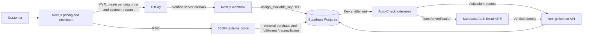
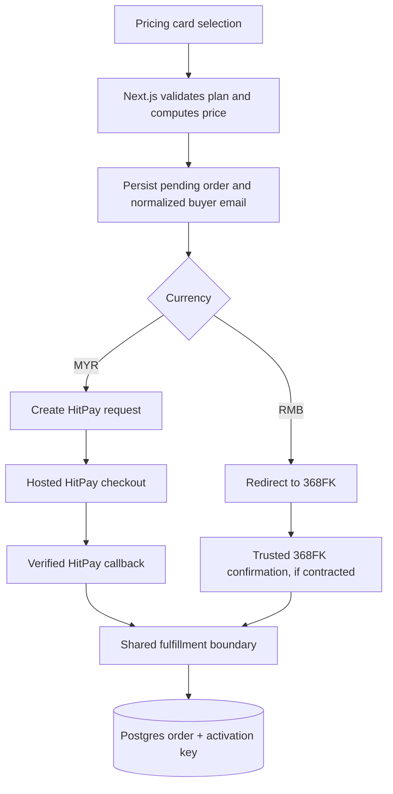

# Payment and License Architecture

**Product:** Auto-Check desktop browser extension for Windows and macOS  
**Architecture status:** Target design; payment, Supabase, key fulfillment, activation, and transfer integrations are not implemented in the current workspace.

This document describes the intended production system and separates confirmed repository behavior from business requirements supplied in the review. Supabase Postgres is the source of truth for orders, key inventory, issued licenses, and device bindings. The Next.js server is the trust boundary for checkout coordination, payment callbacks, license operations, and customer identity checks.

## 1. System Overview

Auto-Check is sold through the Next.js website. MYR purchases are paid through HitPay. RMB purchases leave the site for the external 368FK store; they do not create a HitPay payment. For a verified MYR payment, the server validates the callback and asks Postgres to atomically fulfill the order from inventory. The customer activates the delivered key in the desktop extension. The key belongs to the normalized purchase email; changing its bound device requires that email to pass Supabase Auth Email OTP verification.

Supabase Postgres is the single source of truth. A browser redirect, client-submitted payment status, extension-local state, or unverified email is never sufficient to mark an order paid or change a device binding.



The 368FK order import, payment confirmation, and key delivery contract are not described by the supplied business rules or present in the repository. They must be defined with that provider before RMB orders can share the Supabase fulfillment path. Until then, 368FK owns that purchase and its delivery; a browser redirect alone must not be treated as payment evidence.

## 2. Database Schema

The schema below is the production target. It is not present in the current codebase. Orders and issued keys are separate records linked by IDs; `key_inventory` is a separate stock table required by the specified allocation RPC. Do not put plaintext key material in browser-readable order rows.

### `public.orders`

One row represents a purchase attempt and its payment lifecycle.

| Column | Purpose |
|---|---|
| `id uuid primary key` | Stable internal order ID. |
| `reference text unique not null` | Non-secret support/payment reference. |
| `buyer_email text` | Trimmed, lowercase email captured before payment; required before paid fulfillment. |
| `plan text not null` | Entitlement code constrained to the four allowed values below. |
| `amount_minor integer not null` | Amount in the currency's minor unit, calculated on the server. |
| `currency text not null` | `MYR` for HitPay or `CNY` for RMB/368FK, using the provider's actual currency code. |
| `status text not null` | At minimum `pending`, `paid`, `cancelled`, `refunded`, with a database check constraint. |
| `payment_provider text` | `hitpay`, `368fk`, or an explicitly designated internal source. |
| `provider_payment_id text` | Provider transaction identity; unique when non-null for idempotency. |
| `created_at`, `paid_at`, `refunded_at` | UTC lifecycle timestamps. |

The required plan constraint is:

```sql
CHECK (plan IN ('bundle', 'semester', 'yearly', 'internal_check'))
```

`internal_check` is reserved for authorized internal issuance/checking and must not be exposed as a public purchasable plan. Public checkout maps its catalog selection to one of `bundle`, `semester`, or `yearly`; the server rejects any unrecognized mapping. Store monetary values as integers, and compare callback currency and amount against the immutable server-created order.

### `public.key_inventory`

Private, pre-provisioned stock. Each row represents one unassigned key and includes `id`, `plan`, a unique lookup hash, encrypted key material (if recovery/display requires retrieving the original key), and creation/assignment timestamps. Its `plan` uses the same four-value check constraint. Inventory has no access for `anon` or ordinary authenticated browser roles.

### `public.activation_keys`

One row represents one issued entitlement and its owner/device state. Suggested columns: `id`, unique `order_id`, unique `inventory_id`, normalized non-null `buyer_email`, `plan`, `status`, `device_id`, `issued_at`, `activated_at`, and revocation timestamps. `plan` has the same check constraint. `status` should be constrained to the lifecycle actually implemented (for example `available`, `active`, `revoked`). The activation secret should be stored as a hash for lookup; retain encrypted key material only if the customer portal must reveal/copy the original key.

The unique `order_id` and `inventory_id` relationships prevent two issued keys for one order or two orders consuming the same inventory record. If an order can legitimately issue multiple keys, replace the one-key-per-order assumption with an explicit quantity/line-item model before deployment.

Enable RLS on exposed tables, grant no browser write access to orders, inventory, issued keys, or device bindings, and keep privileged RPC execution restricted to the server's secret database role. Keep that credential server-only; never expose it through a `NEXT_PUBLIC_` variable. RPCs should use a fixed safe `search_path` and validate their arguments and state transitions.

**Identity rule:** normalize the checkout email before storing it (trim and lowercase), and use `activation_keys.buyer_email` as the license owner identity. Supabase Auth supplies proof of control of that email for device transfer. An email in client input or editable user metadata is not proof.

## 3. Checkout & Payment Routing

1. The pricing card sends only a plan selection and locale to the Next.js checkout endpoint. The server validates the public plan, determines the currency route, and calculates price from its catalog. It ignores client-supplied amount, currency, provider, and payment status.
2. The customer supplies `buyer_email` before payment is initiated. The server normalizes and stores it on a pending order, creates a non-secret unique reference, and persists the exact amount/currency/provider expected for that order.
3. **MYR:** the server creates a HitPay payment request using the stored order reference, amount, and MYR currency, then returns the hosted checkout URL. HitPay credentials and callback verification material remain server-only. The browser follows the payment URL.
4. **RMB:** the site directs the customer to 368FK's external store. Do not create a HitPay request or imply that the site has confirmed the external payment. If a key is to be issued from this route, 368FK must provide a trusted server-to-server confirmation/import mechanism with a unique transaction ID and verifiable order/amount details; that mechanism must enter the same idempotent fulfillment boundary. Otherwise key fulfillment remains with 368FK.
5. The success/return page reads order state from the server. Returning to the site is not proof of payment. The order remains pending until trusted provider confirmation is recorded.



**Current repository behavior:** `components/BuyButton.tsx` posts `{ plan, locale }` to `/api/checkout`; `app/api/checkout/route.ts` creates a local SQLite order through `lib/store.ts`. `components/Checkout.tsx` offers a local simulation, labels it as non-payment, and collects the delivery email. Prices in `lib/plans.ts` are MYR minor units. There is no HitPay integration, currency selector, RMB branch, or 368FK connector. Do not describe the local simulation as production checkout.

## 4. Webhook & Fulfillment (Zero-Race Condition)

The production HitPay webhook is a server-only payment trust boundary. It must verify the provider signature using the raw request body and configured HitPay verification method before trusting event fields. Then validate that the event refers to a known order and that the provider transaction, expected amount, and currency match the pending order. Reject malformed, unsigned, mismatched, or unsupported events without changing fulfillment state. A return URL never calls the privileged fulfillment RPC.

After verification, the server invokes `public.assign_available_key` with the internal order ID and trusted payment identity. The RPC runs atomically in one Postgres transaction:

1. Lock the order row with `FOR UPDATE` and validate that its plan, email, currency/provider, and state permit fulfillment.
2. If that provider payment has already fulfilled this order, return the existing result. Unique constraints on provider payment identity, `activation_keys.order_id`, and `activation_keys.inventory_id` provide defense in depth against callback retries and duplicate issuance.
3. Claim one unassigned `key_inventory` row for the exact order plan using `FOR UPDATE SKIP LOCKED`. Concurrent transactions skip rows already claimed by another transaction rather than selecting the same key.
4. Insert the activation-key record with the order's normalized `buyer_email`, matching plan, inventory reference, and initial unactivated status.
5. Mark the order paid and record provider/payment identity and paid timestamp in the same transaction. Return a result that identifies the existing or newly issued entitlement without returning secrets to the webhook caller unnecessarily.

Only the verified server callback may call this RPC. Browser and extension clients cannot execute it. Keep the RPC's own payment/order checks even though the webhook validates first; the database is the final authority on state and uniqueness.

**Empty inventory:** if no unassigned key exists for the exact plan, the RPC must not commit a paid-but-unfulfilled order or a partial key assignment. Roll back and surface a retryable fulfillment failure. Persist non-secret operational diagnostics through a separate safe mechanism if rollback would otherwise discard them; acknowledge/retry the provider callback according to the configured HitPay retry contract, and alert operations to replenish stock. Once stock is available, a retry of the same payment must fulfill the same order once. Never silently substitute another plan.

A transactional outbox or equivalent durable retry record is recommended if provider callback retry behavior cannot guarantee eventual delivery. It should be unique by provider event/payment identity and should not weaken the single fulfillment transaction.

## 5. Client-Side Activation

The Windows/macOS extension submits the entered activation key and a stable installation/device identifier to a server activation endpoint over TLS. The extension is an untrusted client: it does not connect with a Supabase service credential and does not decide entitlement from local state alone.

The server hashes the presented key and performs a constant-time-safe lookup strategy against issued-key records, then checks status, plan, and revocation. For a valid unactivated key, an atomic database operation binds it to the submitted device ID and marks it active. Repeating the request from that same device is idempotent. A request from a different device does not overwrite the binding; it starts the verified transfer process. Responses should contain only the minimum entitlement/status data the extension needs, not buyer PII, key hashes, ciphertext, or database internals.

The precise activation endpoint, device identifier format, offline policy, and entitlement-expiry rules are not implemented or specified in the current workspace. Define these before shipping client activation. If authorization must be checked offline, use a signed, expiring entitlement token and document revocation/refresh behavior; do not embed database credentials or a signing secret in the extension.

## 6. Secure Device Transfer

A device transfer is permitted only after the owner proves control of the normalized `activation_keys.buyer_email` via Supabase Auth Email OTP. A key alone, a device ID supplied by the client, or possession of the old device is insufficient to transfer ownership.

1. The extension requests transfer for the key and new device. The server uses the key record to find the stored owner email; it does not accept a replacement email from the caller. Apply rate limits and return a generic response that does not reveal whether a key/email exists.
2. Supabase Auth sends an OTP to that owner email. Persist a short-lived, single-use transfer request tied to the activation key and proposed new device. Do not store the OTP itself.
3. The user submits the OTP. The server verifies it through Supabase Auth, obtains the verified authenticated identity, and checks that its normalized email equals the key's `buyer_email`.
4. A privileged transfer RPC locks both the pending transfer request and activation-key row. It verifies expiry, attempt/status limits, verified owner identity, requested device, and current key state. In one transaction it replaces `device_id`, records the completion/audit time, and consumes the transfer request.
5. Only after the RPC commits does the server return the new activation state. Invalid, expired, replayed, or wrong-email OTP attempts never alter the binding.

Use short request expiry, bounded attempts, per-key/email/IP throttling, generic errors, and audit records that exclude OTPs and plaintext keys. A lost email account requires a separately defined manual recovery process; support staff must not bypass the atomic owner-verification controls by directly editing a device ID without an audited, reviewed recovery procedure.

## Implementation status and source map

The production architecture above is a target, not a description of deployed functionality. The repository currently contains a loopback-only local preview using Node's built-in SQLite (`lib/store.ts`), a local checkout endpoint (`app/api/checkout/route.ts`), and a simulated completion action in the order API. `lib/security.ts` rejects these APIs in production. The workspace has no Supabase client, commerce migration/RPC, HitPay webhook, 368FK integration, activation API, Supabase Auth OTP flow, or real activation-key inventory. Existing orders use catalog codes such as `extension` and `mobile_notification`; these do not satisfy the requested database plan constraint and require an explicit server-side product-to-entitlement mapping before migration.

The prior draft at `docs/superpowers/specs/2026-10-03-supabase-commerce-license-design.md` is planning material; its schema, plan values, and mock-checkout assumptions differ from the business rules in this document. Resolve those differences in the implementation/migration design before deploying schema or connecting real payments. No live provider, database, or account configuration has been verified by this document.
