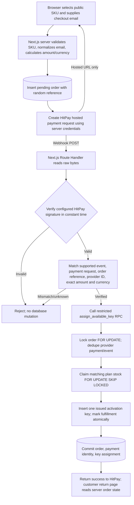

# Auto-Check Pre-flight Architecture & Security Audit

**Review date:** 2026-10-04  
**Scope:** Current workspace, checked-in Supabase migrations, Admin Dashboard/Auth, current local checkout, and the documented production payment/license target.  
**Purpose:** Establish the verified security boundary and identify decisions and controls required before implementing real HitPay payments.  
**Assessment:** **Not ready for live payment or production license fulfillment.** The current workspace contains a local-only commerce simulation and a production-oriented admin key dashboard. The HitPay checkout/webhook, commerce schema/RPC, payment idempotency, and activation API remain unimplemented. This is a source review; no live Supabase/Vercel/HitPay configuration was accessed or verified.

## 1. System topology & tech stack

### 1.1 Stack and trust boundaries

| Layer | Current implementation | Security role |
|---|---|---|
| Web framework | Next.js 16.3.8 App Router, React 19.3.0, TypeScript 7.0.2; Node.js `>=24` declared | Server rendering, Server Actions, and Route Handlers are the application boundary. |
| UI | Tailwind CSS 4.3.3, React Client Components, GSAP/Framer Motion and other UI libraries | Presentation and interaction only. Browser input is untrusted; it cannot establish payment or license state. |
| Persistent data | Local demo commerce uses Node's SQLite (`lib/store.ts`). Production admin key and site-management code uses Supabase JS 2.117.2 and Postgres/Storage through server-only modules. | Current commerce and production key management do not yet share one database model. |
| Deployment target | Vercel is named as the intended production host in the project documentation. No `vercel.json` or live deployment settings are part of the audited workspace. | Deployment configuration, runtime limits, domains, environment values, and production headers remain unverified. |
| Payment provider | HitPay is a planned provider only. | No payment API call, webhook handler, credentials, or provider event persistence exists in this workspace. |

The browser is outside the trust boundary. It may select a public catalog item and provide checkout/contact fields, but the server must compute price and currency, persist order state, verify provider callbacks, and perform license issuance. A successful browser redirect is not payment evidence.

### 1.2 Next.js execution boundaries

Next.js App Router `page.tsx` and `layout.tsx` files are Server Components unless explicitly marked otherwise. This workspace uses that model for `app/page.tsx`, the root layout, `/admin`, and tokenized page wrappers. The `/admin` page reads the signed admin cookie, obtains inventory data on the server, and passes dashboard data to client UI.

| Boundary | Current examples | What can cross it |
|---|---|---|
| **Server Components** | `app/page.tsx`, `app/layout.tsx`, `app/admin/page.tsx`, `app/checkout/[token]/page.tsx`, `app/order/[token]/page.tsx` | Can call server-only data modules and use secrets. Props passed into Client Components must be treated as browser-visible serialized data. |
| **Client Components** | Files with `'use client'`, including `app/admin/AdminDashboard.tsx`, `AdminLoginForm.tsx`, `GeneratedKeysModal.tsx`, `components/Checkout.tsx`, and `components/OrderStatus.tsx` | Browser interaction, React state, and fetch/action invocation. No server secret belongs here. Generated plaintext keys are intentionally returned to the browser once for operator capture. |
| **Server Actions** | `'use server'` modules: `app/admin/actions.ts`, `operations-actions.ts`, `site-actions.ts` | Callable through a POST request, not only through the rendered UI. Every protected action must authenticate and authorize internally. Existing key generation and site-management mutations call `requireAdminSession()`. |
| **Route Handlers** | `app/api/**/route.ts` | HTTP endpoints implemented with Web `Request`/`Response`. Existing checkout/order/support/admin endpoints are local demo endpoints guarded by `localOnly()`. There is no `app/api/hitpay/webhook/route.ts`. |

Installed Next.js documentation for this exact package version confirms that Server Actions are network-reachable and require authorization checks inside each action. The current admin write actions follow this rule. Do not move a webhook into a client component or trust UI-only route gating.

### 1.3 Current application behavior

- `/api/checkout` creates a local SQLite order, and `/checkout/[token]` supports a clearly labeled simulation. `/api/orders/[token]` allows simulated completion/cancellation. The `localOnly()` guard rejects requests in production and non-loopback hosts; local mutations also check same-origin `Origin`.
- `/admin` is the production-oriented key/site-management dashboard. `/admin/local` and the legacy `/api/admin*` endpoints are a separate local demo path using `LOCAL_ADMIN_PASSWORD`; they are not the production admin-auth implementation.
- The current product catalog IDs (`bundle`, `extension`, `mobile_notification`, `mobile_notification_yearly`) do not map one-to-one to the target entitlement plan values. The payment architecture draft's plan values must be reconciled with real SKU/entitlement semantics before checkout is connected.
- No real payment, email delivery, activation redemption, Supabase Auth OTP, or customer license portal is present. The project README explicitly labels commerce as local simulation.

## 2. Database & data integrity

### 2.1 Existing `public.activation_keys` migration

The checked-in migration `supabase/migrations/20261003162918_activation_keys.sql` defines the following table. This is the exact committed DDL; it is not the target's future order-linked issued-key schema.

| Column | PostgreSQL definition | Meaning |
|---|---|---|
| `id` | `uuid primary key default gen_random_uuid()` | Row identifier. |
| `key_hash` | `text not null` | Canonical activation code's lowercase SHA-256 hex digest. |
| `plan_type` | `text not null` | Entitlement plan identifier. |
| `status` | `text not null default 'available'` | Key state. |
| `buyer_email` | `text` nullable | Purchaser identity after redemption. |
| `device_id` | `text` nullable | Future/current device binding field; no redemption API is implemented. |
| `redeemed_at` | `timestamptz` nullable | Redemption timestamp. |
| `created_at` | `timestamptz not null default now()` | Provisioning time. |

Constraints and indexes:

- `key_hash` is unique and must match `^[0-9a-f]{64}$`; the unique constraint provides the lookup index.
- `plan_type` is limited to `bundle`, `semester`, `yearly`, `internal_check`.
- `status` is limited to `available`, `redeemed`, `revoked`.
- An `available` key must have null `buyer_email`, `device_id`, and `redeemed_at`.
- A `redeemed` key must have non-null `redeemed_at`.
- Non-null `buyer_email` must be non-empty and equal to `lower(btrim(buyer_email))`.
- A secondary index orders by `(created_at DESC, id DESC)`; another indexes `(plan_type, status)`.
- There are no order or inventory foreign keys, no key-expiry field, no activation attempt fields, and no explicit state-transition trigger in this migration.

### 2.2 Existing RLS and grants

`activation_keys` has Row Level Security enabled **and forced**. The migration revokes all table privileges from `PUBLIC`, `anon`, `authenticated`, and first revokes all from `service_role`, then grants `service_role` only `SELECT`, `INSERT`, `UPDATE`, and `DELETE`. It creates **no browser RLS policies**. Ordinary Supabase browser roles therefore have no table privileges and no matching policies; direct Data API access is denied.

The application server uses `SUPABASE_SERVICE_ROLE_KEY` in `lib/supabase/admin.ts`. Supabase's service role is privileged and bypasses RLS; RLS is not a substitute for authorization on this path. `getSupabaseAdmin()` first calls `requireAdminSession()`, checks that the configured project URL is HTTPS (or loopback HTTP outside production), refuses anonymous-key fallback, and creates an uncached client with session persistence/refresh disabled and `fetch` set to `cache: 'no-store'`. The server-only import and environment variable naming keep the service key out of the client bundle. A leaked service-role key would bypass these row policies and expose/mutate the table, so it must be treated as a database super-credential.

The site-management migration similarly enables and forces RLS on its private settings, revisions, activity, assets, and upload tables, revokes browser-role grants, and grants narrowly selected privileges to `service_role`. Its `manage_site_configuration` and `revoke_activation_key` functions use `SECURITY INVOKER`, a fixed `search_path`, and explicit `EXECUTE` grants to `service_role` only. The site-management setup document says these migrations are generated locally and have not been applied to a cloud project. Cloud migration state is therefore unverified.

### 2.3 Planned `public.orders` target (not deployed)

There is **no** `public.orders` Postgres table or commerce migration in `supabase/migrations/`. The latest target document, `docs/payment-and-license-architecture.md`, describes these order fields; the earlier commerce design spec has a conflicting field name and plan vocabulary. This is the latest documented target, not deployed DDL:

| Column | Target type | Target requirement in current architecture notes |
|---|---|---|
| `id` | `uuid` | Primary key. |
| `reference` | `text` | Unique, non-null, non-secret payment/support reference. |
| `buyer_email` | `text` | Trimmed lowercase checkout email; required before paid fulfillment. Exact nullability at order creation needs to be finalized. |
| `plan` | `text` | Non-null; intended check set is `bundle`, `semester`, `yearly`, `internal_check`. `internal_check` must not be purchasable publicly. |
| `amount_minor` | `integer` | Non-null, server-calculated amount in currency minor units. The target does not yet state a positivity/range constraint. |
| `currency` | `text` | Non-null; documented values include `MYR` for HitPay and `CNY` for the external 368FK route. The exact supported set must be decided. |
| `status` | `text` | Non-null; check at least `pending`, `paid`, `cancelled`, `refunded`. Exact transitions and partial-refund semantics are not defined. |
| `payment_provider` | `text` | `hitpay`, `368fk`, or an explicitly designated internal source; nullability and check constraints are not finalized. |
| `provider_payment_id` | `text` | Provider transaction identity; intended unique when present for idempotency. Whether implemented as a partial unique index is not yet specified. |
| `created_at` | `timestamptz` | Creation timestamp; the DDL default is not specified in the current target. |
| `paid_at` | `timestamptz` | Paid timestamp. |
| `refunded_at` | `timestamptz` | Refund timestamp. |

The older design draft instead calls the product column `plan_code`, uses `extension` and `mobile_notification` product plans, permits `buyer_email` to be null until entered at checkout, and adds a `fulfillment_error` diagnostic. Neither variant is a frozen/implemented SQL contract. Before payment code is written, freeze one migration-level DDL including all `NOT NULL`, `CHECK`, `UNIQUE`, foreign-key, indexes, provider-event dedupe, monetary range, and state-transition rules. At minimum, enforce normalized non-empty email before fulfillment; unique non-null provider payment identity; server-only write grants; exact amount/currency/reference matching; and one fulfillment per order.

### 2.4 Target inventory/issued-key mismatch

The payment blueprint calls for a separate private `key_inventory` pool plus an order-linked `activation_keys` issued-entitlement record. Neither `key_inventory` nor the planned `orders`/RPC tables exist. The current `activation_keys` table is a stand-alone pool that the admin dashboard inserts directly into. These are materially different models. Do not implement `assign_available_key` against the existing table until a migration design states how keys move from stock to issued entitlement and whether the existing table is replaced, altered, or split.

The latest payment architecture says the target issued-key record should link to `orders` and `key_inventory`, with unique `order_id` and `inventory_id`; the older design instead includes `plan_type` values including `extension` and a `key_ciphertext` recovery option. In contrast, the existing schema stores only a hash and has status `available`/`redeemed`/`revoked`. Decide the authoritative plan codes, statuses, uniqueness cardinalities, activation-key re-display/recovery requirement, refund/revocation behavior, and migration path before issuing customer keys.

### 2.5 RLS and authorization requirements for commerce

The proposed order, inventory, issued-key, payment-event, and transfer tables must not expose writes or secrets to `anon` or browser `authenticated` roles. For the target service-role design, enable and force RLS, revoke browser grants, add no client policies unless a separately reviewed customer-read use case requires them, and grant the server role only what its specific pathways need. Restrict RPC `EXECUTE` explicitly; use a fixed safe `search_path`; validate order/provider/status/plan/email inside the function; and rely on database constraints in addition to TypeScript checks. No browser receives a database service credential.

If future customers query their own license/order data directly using Supabase Auth, create narrow SELECT-only policies tied to a verified JWT email or immutable user ID. Do not expose inventory or permit browser mutations. The current workspace has no browser Supabase client, customer Auth integration, or customer-facing RLS policy.

## 3. Admin & authentication security

### 3.1 Production dashboard session

The current `/admin` session is implemented in `lib/admin-auth.ts` and uses a dedicated password plus a separately generated 32-byte session-signing key:

1. Configuration requires `ADMIN_DASHBOARD_PASSWORD` of 12–1,024 UTF-8 bytes and `ADMIN_SESSION_SECRET` as 64 hex characters (32 bytes). Missing/invalid configuration fails closed.
2. The configured password is held as a server environment secret, not in the database. At verification time, code computes a fixed-length SHA-256 digest of the candidate and configured password, then compares the 32-byte values using `timingSafeEqual`. Malformed/non-string/oversized input is normalized to an empty string for the digest comparison. Failed/malformed attempts wait 2,000 ms and receive a generic response.
3. After successful password verification, a Server Action sets a signed cookie. Payload format is `v1.<issuedAt>.<expiresAt>.<nonce>`, where the nonce is 16 random bytes encoded as 32 lowercase hex characters. HMAC-SHA-256 covers a domain separator, the password digest, and the payload using the separate signing key.
4. The cookie value appends a 64-character lowercase-hex HMAC. Validation enforces a strict format/size, constant-time signature comparison, non-future issue time, unexpired time, and exactly eight hours between issue and expiry.
5. TTL is eight hours. Production uses a host-only `__Host-auto_check_admin` cookie with `Secure`, `HttpOnly`, `SameSite=Strict`, `Path=/`, and no `Domain`; local development uses `auto_check_admin` and disables `Secure` for loopback HTTP. Logout expires the cookie.
6. Rotating either password or session secret invalidates existing cookies because the HMAC depends on both. There is no server-side session registry or individual session revocation; a copied cookie remains usable until expiry or rotation.

SHA-256 here is used as a fixed-length comparison normalization, **not** as a stored password verifier. The configured admin password remains a plaintext environment secret; protect it with Vercel secret storage, access control, and rotation. For a single-operator password, avoid committing the value, logging it, or reusing the local demo password. If the threat model requires resistance to offline password-database cracking, this design does not provide a salted memory-hard password hash; it avoids a password database by relying on the secret manager.

### 3.2 Authorization and limits

`app/admin/page.tsx` gates dashboard rendering, while each privileged Server Action separately invokes `requireAdminSession()`. `getSupabaseAdmin()` independently checks the session before constructing a service-role client. These layered checks are required because Server Actions are network endpoints and the page gate alone would not protect mutations. Login relies on Next.js Server Action same-origin protections; the cookie is also `SameSite=Strict`.

The fixed two-second failure delay is **not** a rate limiter: it is stateless, can be parallelized, and has no per-IP/account counter. The production Server Action has no explicit login throttle in the current code. This is a residual online brute-force/denial-of-service risk; add a shared, durable rate limit and monitoring appropriate to Vercel's horizontally scaled runtime before exposure. Do not treat the legacy local route's in-memory throttle as production protection.

The legacy `/admin/local` demo uses `LOCAL_ADMIN_PASSWORD` and the `vf_admin` cookie from `lib/security.ts`. The app intentionally rejects its APIs when `NODE_ENV=production`, when `LOCAL_DEMO` is not `true`, or when the request host is not loopback. The README also contains a sample local password; it must not be reused for production.

## 4. Key lifecycle: generation to redemption

### 4.1 Current generation and one-time disclosure

`lib/admin-keys.ts` generates each code using `crypto.randomBytes(24)`: 24 bytes = 192 bits of CSPRNG entropy. All 48 hex digits are preserved, uppercased, and formatted as `AC-` plus twelve four-character groups. The plan and batch count are validated by `generateKeysAction()`; count is an integer from 1–100 and plan is allowlisted.

For storage, `hashActivationCode()` trims surrounding whitespace, uppercases the code, preserves hyphens, validates the complete format, and computes lowercase hexadecimal SHA-256. A full batch is generated and hashed before one multi-row INSERT. The database stores only `key_hash`, plan, state, and metadata; there is no encrypted/plaintext key column. A failed insert returns no generated batch to the client.

After a successful insert, the Server Action returns plaintext codes in its response so the authenticated operator can copy or download them once. The client holds them in transient React state in `GeneratedKeysModal`; the modal clears the state on dismissal. Codes are not returned in the initial inventory query, persisted in local storage, or recoverable from the database. Because the operator's browser must receive the one-time action result, the plaintext necessarily exists in the browser response and memory during capture; treat that authenticated browser and its session as sensitive. Do not log action payloads, include codes in telemetry, persist them in browser storage, or expose them in later inventory reads.

Canonicalization is part of the key protocol: any future validator/importer must apply the same trim → uppercase → preserve hyphens → SHA-256 procedure. The stored migration requires 64 lowercase hex characters, matching the current digest output.

### 4.2 Future purchase and activation states

The current migration/admin screen can create and revoke keys, but it does not redeem or bind a key. The planned client flow is:

1. Extension sends the entered activation code and a stable installation/device identifier to a TLS-protected Next.js API. The extension is untrusted and must never contain a Supabase service-role key or signing secret.
2. The server validates and hashes the input with the same canonicalization; it queries the private issued-key table and checks entitlement plan, state, and revocation.
3. A database transaction locks the key row. If unredeemed and valid, it atomically binds the device and marks it redeemed. Repeated activation for that same device returns an idempotent success; another device cannot overwrite the binding.
4. Device transfer is a distinct flow. The server sends OTP to the key's stored normalized owner email through Supabase Auth; it does not accept a caller-supplied email as proof. A short-lived, single-use transfer record binds the key and proposed new device. After Supabase verifies the OTP and the authenticated email matches the stored owner, a transfer RPC locks both rows, validates expiry/attempt/state, changes the binding and consumes the request atomically.
5. Return only minimum entitlement state to the extension. Do not return buyer PII, hashes, ciphertext, or database diagnostics.

Activation endpoint, device-ID format, rate limits, offline entitlement token, expiration/revocation model, and transfer recovery process are not implemented or fully specified. These need explicit decisions and an abuse model before public release. Key compromise recovery and buyer-account recovery cannot rely on an unaudited admin edit.

## 5. HitPay payment & fulfillment flow — target blueprint

Nothing in this section is implemented in the repository. The diagram represents the intended trust path, not a deployed system.

### Step 1 — initiate checkout

The browser submits only an allowlisted public SKU/plan and locale plus the customer's email. The server normalizes the email (trim and lowercase), maps public product code to one canonical entitlement, calculates amount/currency from the server catalog, generates a non-secret random order reference, and inserts a pending order before contacting HitPay. Ignore client-supplied amount, currency, provider, payment status, and internal-only plan values. Persist the exact amount/currency/provider expected before request creation.

The server makes the payment-request call using server-only HitPay credentials and sends the order reference plus required hosted-checkout fields. Return only the provider's validated HTTPS checkout URL and a non-secret order reference to the browser. Handle provider timeouts and retries without creating duplicate charges: use a stable idempotency/reference strategy supported by the current HitPay API, persist the returned payment-request identifier, and reconcile ambiguous outcomes. Do not expose API keys or signing salts to Client Components.

The project blueprint routes MYR to HitPay and describes an RMB/368FK external route separately. The external route has no confirmed server-to-server order/payment reconciliation contract; it must not share the HitPay fulfillment path until a trusted confirmation mechanism is defined. The current catalog/entitlement mapping is inconsistent (see §2.4), and must be fixed first.

HitPay's published API currently documents payment-request creation with `X-BUSINESS-API-KEY` and a hosted URL response. The integration should use the API reference and sandbox matching the merchant account/market; the website's overview sample is not a substitute for versioned request/response validation.

### Step 2 — verify webhook and enforce idempotency

The Route Handler must read the request body as raw bytes exactly once, obtain the signature header, and verify before parsing or trusting event data. Use a constant-time comparison after validating signature encoding and equal lengths. Reject absent/malformed signatures, invalid JSON, unsupported event types, unknown orders, wrong provider request/payment identity, reference mismatch, amount mismatch, currency mismatch, and invalid order-state transitions without fulfillment side effects. A browser return/redirect is never an authoritative callback.

**HitPay signature selection is a required implementation decision.** HitPay's current event-webhook docs describe `Hitpay-Signature`: HMAC-SHA-256 over the raw JSON body using the salt assigned to that webhook endpoint. The docs distinguish this from legacy payment-request/charge callbacks, whose `hmac` is in the payload and uses the API-key salt over sorted/concatenated parameters. Do not mix the two schemes or use the API-key salt for an event webhook. Select the event type and account webhook configuration, then lock the implementation to that documented scheme and test it against HitPay sandbox fixtures. See [HitPay Webhooks](https://docs.hitpayapp.com/apis/guide/events#validating-webhook) and [HitPay API Overview](https://docs.hitpayapp.com/apis/overview).

Idempotency must be durable in Postgres, not an in-memory Vercel process map. Persist/deduplicate provider event identity and/or provider payment-request/transaction identity under unique constraints. Replayed callbacks return the existing fulfillment outcome without issuing a second key. A unique provider payment ID must not be accepted for two orders. Confirm the exact event payload/status fields and success/failure/refund event semantics for the chosen HitPay payment-request API before coding.

### Step 3 — atomic order lock and key claim

`public.assign_available_key(...)` is a planned Postgres RPC, not present in the workspace. It must be executable only by the trusted server role. In one transaction it should:

1. Lock the target order row `FOR UPDATE`; validate its current state, provider, reference/payment identity, email, plan, amount/currency facts as persisted, and one-key-per-order rule.
2. If the order/provider payment has already been fulfilled, return that existing result idempotently. Reject conflicting provider IDs and cancelled/refunded/otherwise ineligible states.
3. Select exactly one unassigned `key_inventory` row for the matching canonical entitlement plan using `FOR UPDATE SKIP LOCKED`, then mark/consume that inventory row in the same transaction. Different concurrent orders skip rows already locked by another transaction; same-order callbacks serialize on the order lock.
4. Insert the issued-key row tied uniquely to the order and inventory item; copy the normalized `buyer_email` from the order, never from webhook/client data.
5. Record provider/payment identity and update payment/fulfillment status in the same transaction, with unique constraints as a second line of defense.
6. Commit only after both the order transition and key assignment succeed. Return a minimal non-secret result.

`FOR UPDATE SKIP LOCKED` prevents concurrent transactions from selecting the same stock row, but it does not by itself make the whole workflow safe: the order lock, unique constraints, explicit state checks, and atomic status updates are also required. The RPC should not return activation plaintext to the webhook.

**Inventory exhaustion and callback acknowledgement require an explicit reliability policy.** The current architecture draft says to roll back if stock is unavailable and retry the callback, while the payment itself may already have succeeded. A robust production design must preserve the fact that money was captured while fulfillment is pending; model payment status separately from fulfillment status or durably enqueue a retry/outbox record keyed by provider identity. Define retry/ack behavior from HitPay's webhook contract, alert operations, and never silently substitute another plan or lose a successful payment because inventory is empty.

### 5.1 Payment implementation gates

- Freeze entitlement mapping and the canonical commerce DDL/migration, including order and issued-key relationships.
- Decide the HitPay callback family, exact webhook event names, request IDs, success status, signing salt, sandbox/live separation, callback response/retry policy, and refund/partial-refund treatment from current HitPay docs/account settings.
- Add persisted provider event/payment idempotency and atomic fulfillment RPC with narrow grants, fixed `search_path`, validation, and transaction-level rollback tests.
- Define checkout throttling, request bounds, origin/redirect validation, API timeouts, durable retry/reconciliation, logging/redaction, alerting, and operational key replenishment.
- Keep real payment credentials unavailable in local mock mode and impossible to expose through browser code. Do not deploy live payment until sandbox-to-production evidence and an external review are complete.

## 6. Environment variables map

The following inventory is based on `.env.example`, repository runtime references, and documented future requirements. `.env.local` was not read or copied into this report. Use separate sandbox and production provider credentials. Store production values in Vercel's encrypted environment settings, with least access and rotation.

### 6.1 Current production/server-only values

| Variable | Status | Scope / handling |
|---|---|---|
| `ADMIN_DASHBOARD_PASSWORD` | Required for production admin | Server-only secret, 12–1,024 UTF-8 bytes. Never prefix with `NEXT_PUBLIC_`. |
| `ADMIN_SESSION_SECRET` | Required for production admin | Server-only secret, 32 random bytes encoded as 64 hex characters. Rotation invalidates sessions. |
| `SUPABASE_URL` | Required for production admin/site management | Server configuration. Use the HTTPS project origin; current client validates URL shape. URL is generally not a credential, but there is no reason to expose it to browser code here. |
| `SUPABASE_SERVICE_ROLE_KEY` | Required for production admin/site management | Highly privileged server-only secret. Bypasses RLS. Never serialize or expose to browser; no public-key fallback is used. |

There are currently no HitPay environment variables in `.env.example` or application code because integration is not implemented.

### 6.2 Planned HitPay/server-only values — names not yet standardized in repository

| Proposed configuration | Purpose | Handling/status |
|---|---|---|
| HitPay business API key (for example `HITPAY_API_KEY`) | Authenticates server-side payment-request creation. | **Name illustrative only**, not defined in app. Server-only; sandbox and production values must differ. |
| HitPay webhook salt (for example `HITPAY_WEBHOOK_SALT`) | Verifies `Hitpay-Signature` for the registered event webhook. | **Name illustrative only**, not defined in app. Server-only; use the endpoint-specific salt for event webhooks. |
| HitPay API-key salt (only if the selected API callback family requires it) | Verifies the legacy payload `hmac` callback family. | **Name illustrative only**; distinct from the per-webhook salt. Do not configure/use unless the chosen callback contract requires it. Server-only. |
| HitPay environment/base URL or mode | Selects sandbox versus production API host/account. | **Not currently defined.** Choose an explicit validated deployment setting; never accept provider host/mode from browser input. |

Before implementation, select exact env names and fail closed if values are absent or inconsistent. Never use a `NEXT_PUBLIC_` prefix for provider credentials, webhook salts, admin secrets, signing keys, or service-role keys.

### 6.3 Local-only, optional, and test configuration

| Variable | Scope / handling |
|---|---|
| `LOCAL_DEMO` | Local preview gate; must not enable production APIs. Set `true` only for local testing. |
| `LOCAL_ADMIN_PASSWORD` | Separate local demo admin secret; minimum 12 characters by current code/README. Not the production dashboard password. |
| `LOCAL_DB_PATH` | Optional local SQLite path override for demo orders/support. Server/local only. |
| `SITE_MANAGEMENT_LOCAL` | Optional local site-management preview mode; also requires `LOCAL_DEMO=true`, non-production, loopback. |
| `SITE_MANAGEMENT_DB_PATH` | Optional local SQLite settings database path. Server/local only. |
| `SITE_MANAGEMENT_ASSET_DIR` | Optional local site upload directory. Server/local only. |
| `NEXT_PUBLIC_TUTORIAL_VIDEO_URL` | Mentioned in README as a future client-visible tutorial URL; no runtime reference was found during this review. If later used, only a non-secret public HTTPS URL is suitable. Not currently required. |
| `NEXT_PUBLIC_SUPABASE_ANON_KEY` | Appears only in a test fixture; no browser Supabase client/runtime reference was found. Not a current application requirement. A Supabase publishable/anon key is not equivalent to service-role access, but still requires RLS and should only be introduced for a reviewed browser data path. |
| `ADMIN_PREVIEW_PASSWORD`, `ADMIN_FIXTURE_PORT`, `SITE_MANAGEMENT_TEST_DB`, `PERF_LABEL`, `PERF_ENFORCE`, `NEXT_DIST_DIR` | Test/preview/build controls referenced by scripts/configuration. Do not configure as live credentials. `NODE_ENV` is framework/runtime-managed. |

No runtime application variable with `NEXT_PUBLIC_` was identified in the current source. Treat all admin, database, payment, and webhook signing secrets as server-only. `.env.example` is incomplete for several optional local/test variables and future HitPay settings; update it when those are deliberately introduced, without adding real values.

## 7. Auditor findings and readiness decision

| Severity | Finding | Required disposition before live payments |
|---|---|---|
| **Critical / release blocker** | No HitPay endpoint, webhook verification, Postgres orders table, fulfillment RPC, or durable callback idempotency is implemented. Current checkout simulates payment locally. | Implement and independently review the complete trusted payment path before accepting real funds. |
| **High** | Current `activation_keys` schema is an admin-provisioned pool; target design expects separate inventory and order-linked issued entitlements. | Freeze migration and data model before creating orders or issuing sale keys. |
| **High** | Product codes and entitlement plan values conflict across current catalog, existing key migration, latest architecture, and earlier design draft. | Approve one server-side SKU → plan mapping and align constraints/UI/RPC. Keep internal plan values unreachable from public checkout. |
| **High** | Production admin login has a fixed delay but no shared rate limiter or explicit monitoring. | Add distributed throttling and alerting suitable for a horizontally scaled deployment. |
| **High** | Empty inventory after successful payment could leave payment and fulfillment state inconsistent if webhook retries are exhausted or acknowledgement is wrong. | Define durable retry/outbox and separate payment/fulfillment state; rehearse recovery and reconciliation. |
| **High** | Supabase service role bypasses RLS; compromise permits broad data access/mutation. | Keep it server-only, restrict Vercel project access, rotate, redact, monitor, and narrow database/API permissions where feasible. |
| **Medium** | Admin sessions are stateless and remain valid until expiry or secret rotation if copied. | Protect operator devices, rotate secrets on incident, and consider revocation/session registry if threat model requires it. |
| **Medium** | Checkout/payment request creation can time out after provider acceptance, creating ambiguous/repeated charges without provider idempotency/reconciliation. | Use provider-supported idempotency, persist request identity and reconcile uncertain creation outcomes. |
| **Medium** | Activation, abuse limits, license revocation/refunds, device transfer, and lost-email recovery are still target design only. | Specify and implement before customer key activation goes live. |
| **Informational** | The repository documents Vercel as target, but no live Vercel environment/deployment, Supabase project, or HitPay account was inspected. | Verify deployment configuration and sandbox/live boundaries during release readiness review. |

### Evidence reviewed

- Runtime/source: `package.json`, `app/**`, `components/**`, `lib/**`, `.env.example`, `next.config.ts`, and `README.md`.
- Database: `supabase/migrations/20261003162918_activation_keys.sql`, `supabase/migrations/20261003182731_site_management.sql`.
- Security/architecture docs: `docs/payment-and-license-architecture.md`, `docs/admin-key-dashboard-setup.md`, `docs/site-management-setup.md`, and the prior Supabase commerce design/spec and plan files.
- Relevant installed Next.js 16.3.8 docs: App Router Server/Client Components, Mutating Data/Server Actions, and Route Handlers under `node_modules/next/dist/docs/01-app/01-getting-started/`.
- Provider reference checked for this review: [HitPay API Overview](https://docs.hitpayapp.com/apis/overview) and [HitPay Webhooks and signature validation](https://docs.hitpayapp.com/apis/guide/events#validating-webhook). Provider docs and account settings should be rechecked when implementation begins.

**Final decision:** Keep real HitPay credentials and live endpoints disabled. The admin key dashboard has meaningful controls for its current scope, but the commerce, payment, and redemption security boundary is still a blueprint. Resolve the listed high-severity data-model and fulfillment decisions, implement the controls, and obtain external review before production payment enablement.
